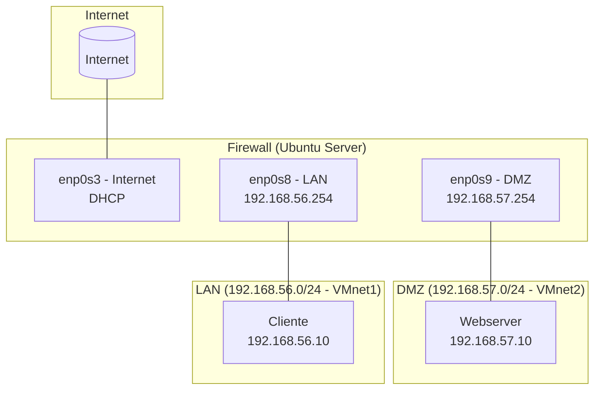

# Laboratório de Segurança – Fase 1: Infraestrutura e Firewall

## Objetivo
Implementar um ambiente virtual composto por três redes interconectadas (LAN, DMZ e Internet), com um **firewall Ubuntu Server** central realizando:
- Roteamento entre redes
- NAT (saída para Internet)
- DNAT (redirecionamento de serviços)
- Base para monitoramento (fase Nagios)

---

## Lab de Segurança Topologia VMware



---

## Configuração do Firewall (Ubuntu Server)

### 1️⃣ Ativação do roteamento IPv4
```bash
sudo sysctl -w net.ipv4.ip_forward=1
sudo sed -i '/^#*net.ipv4.ip_forward/c\net.ipv4.ip_forward=1' /etc/sysctl.conf
```

### 2️⃣ Regras de NAT e FORWARD
#### 🔹 NAT (saída para Internet)
```bash
sudo iptables -t nat -A POSTROUTING -s 192.168.56.0/24 -o enp0s3 -j MASQUERADE
sudo iptables -t nat -A POSTROUTING -s 192.168.57.0/24 -o enp0s3 -j MASQUERADE
```

#### 🔹 DNAT (porta 80 → Webserver)
```bash
sudo iptables -t nat -A PREROUTING -i enp0s3 -p tcp --dport 80 -j DNAT --to-destination 192.168.57.10:80
```

#### 🔹 Encaminhamento de pacotes
```bash
sudo iptables -A FORWARD -i enp0s8 -o enp0s3 -j ACCEPT
sudo iptables -A FORWARD -i enp0s9 -o enp0s3 -j ACCEPT
sudo iptables -A FORWARD -i enp0s3 -o enp0s8 -m state --state RELATED,ESTABLISHED -j ACCEPT
sudo iptables -A FORWARD -i enp0s3 -o enp0s9 -m state --state RELATED,ESTABLISHED -j ACCEPT
```

#### 🔹 Persistência
```bash
sudo apt install -y iptables-persistent
sudo netfilter-persistent save
```

---

## Configuração de rede das VMs

### 🔹 Firewall
```yaml
network:
  version: 2
  renderer: networkd
  ethernets:
    enp0s3:       # Interface externa (Internet)
      dhcp4: true
    enp0s8:       # Rede LAN interna
      addresses: [192.168.56.254/24]
    enp0s9:       # Rede DMZ
      addresses: [192.168.57.254/24]
```

### 🔹 Cliente (LAN)
```yaml
network:
  version: 2
  ethernets:
    enp0s3:
      addresses: [192.168.56.10/24]
      routes:
        - to: default
          via: 192.168.56.254
      nameservers:
        addresses: [8.8.8.8]
```

### 🔹 Webserver (DMZ)
```yaml
network:
  version: 2
  ethernets:
    enp0s3:
      addresses: [192.168.57.10/24]
      routes:
        - to: default
          via: 192.168.57.254
      nameservers:
        addresses: [8.8.8.8]
```


---

## Testes Realizados

| Teste | Origem | Resultado |
|-------|---------|-----------|
| `ping 192.168.56.254` | Cliente → Firewall | ✅ OK |
| `ping 192.168.57.254` | Webserver → Firewall | ✅ OK |
| `ping 8.8.8.8` | Cliente/Webserver | ✅ OK (via NAT) |
| `curl http://192.168.0.X` | Host real → Webserver | ✅ OK (via DNAT) |
| `tcpdump -i any icmp` | Firewall | ✅ ICMP visível |

---

## Script do Firewall

```bash
#!/bin/bash
sysctl -w net.ipv4.ip_forward=1
iptables -F
iptables -t nat -F

iptables -t nat -A POSTROUTING -s 192.168.56.0/24 -o enp0s3 -j MASQUERADE
iptables -t nat -A POSTROUTING -s 192.168.57.0/24 -o enp0s3 -j MASQUERADE

iptables -t nat -A PREROUTING -i enp0s3 -p tcp --dport 80 -j DNAT --to-destination 192.168.57.10:80

iptables -A FORWARD -i enp0s8 -o enp0s3 -j ACCEPT
iptables -A FORWARD -i enp0s9 -o enp0s3 -j ACCEPT
iptables -A FORWARD -i enp0s3 -o enp0s8 -m state --state RELATED,ESTABLISHED -j ACCEPT
iptables -A FORWARD -i enp0s3 -o enp0s9 -m state --state RELATED,ESTABLISHED -j ACCEPT

apt-get install -y iptables-persistent
netfilter-persistent save
```

---

## Próxima Fase: Monitoramento com Nagios

### Elementos a Monitorar

| Host | IP | Itens Sugeridos |
|------|----|-----------------|
| **Firewall** | 192.168.56.254 / 192.168.57.254 | Latência, ICMP, CPU/memória, serviço iptables |
| **Cliente** | 192.168.56.10 | ICMP reachability |
| **Webserver** | 192.168.57.10 | ICMP + HTTP (porta 80) |
| **Externo (teste)** | 8.8.8.8 | ICMP (verificar saída Internet) |

### Planejamento Sugerido

- Instalar **Nagios Core** no **Firewall**
- Configurar **NRPE** no **Cliente** e **Webserver**
- Criar hosts e serviços Nagios:
  - `check_ping`
  - `check_http`
  - `check_load`, `check_disk`
- Implementar notificações (e-mail ou log local)
