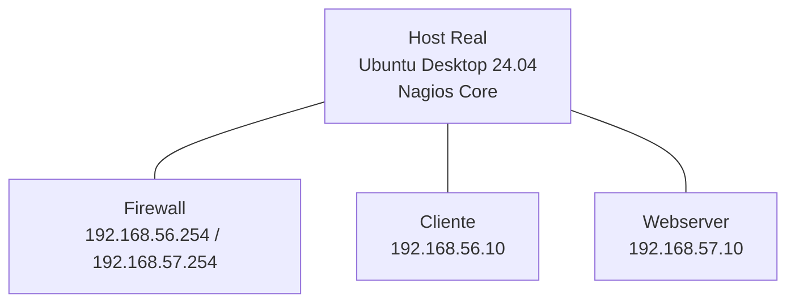

# Laboratório de Segurança – Fase 2: Monitoramento com Nagios Core (v4.5.9)

## Objetivo
Implantar o **Nagios Core 4.5.9** no **host real (Ubuntu Desktop 24.04)** para monitorar os três servidores do laboratório:
- **Firewall** (192.168.56.254 / 192.168.57.254)
- **Cliente** (192.168.56.10)
- **Webserver** (192.168.57.10)

O objetivo é acompanhar **disponibilidade, desempenho e serviços críticos**, estabelecendo uma base de **monitoramento centralizado**.

---

## Topologia

> O Nagios monitora as VMs via ICMP, HTTP e **NRPE** (remote plugin executor).  

---

## 1️⃣ Instalação do Nagios Core (Host real)

### 🔹 Instalar dependências
```bash
sudo apt update
sudo apt install -y apache2 php libapache2-mod-php build-essential wget unzip openssl libssl-dev daemon libgd-dev libgd3 php-gd php-cli php-xml php-zip php-common php-mbstring php-cgi
```

---

### 🔹 Baixar e compilar a versão mais recente (4.5.9)
```bash
cd /tmp
wget https://github.com/NagiosEnterprises/nagioscore/releases/download/nagios-4.5.9/nagios-4.5.9.tar.gz
tar zxvf nagios-4.5.9.tar.gz
cd nagios-4.5.9
sudo ./configure --with-httpd-conf=/etc/apache2/sites-enabled
sudo make all
sudo make install-groups-users
sudo usermod -aG nagios www-data
sudo make install
sudo make install-daemoninit
sudo make install-commandmode
sudo make install-config
sudo make install-webconf
```

---

### 🔹 Criar usuário para acesso à interface web
```bash
sudo htpasswd -c /usr/local/nagios/etc/htpasswd.users nagiosadmin
```
> Defina a senha para o usuário `nagiosadmin`.

---

### 🔹 Ativar módulos e iniciar Nagios
```bash
sudo a2enmod cgi rewrite
sudo systemctl restart apache2
sudo systemctl enable nagios
```

Acesse no navegador:
```
http://localhost/nagios
```
Usuário: `nagiosadmin`  
Senha: *(a que você criou)*

---

## 2️⃣ Instalar e configurar o NRPE nas VMs

Execute nas 3 VMs (**Firewall**, **Cliente**, **Webserver**):
```bash
sudo apt update
sudo apt install -y nagios-nrpe-server monitoring-plugins-basic monitoring-plugins-common
```

---

### 🔹 Editar o arquivo de configuração NRPE
```bash
sudo nano /etc/nagios/nrpe.cfg
```
Modifique:
```
allowed_hosts=127.0.0.1,192.168.56.1
```
> Substitua `192.168.56.1` pelo IP do **host real** (Ubuntu Desktop).

Adicione:
```
dont_blame_nrpe=1
```

Reinicie o serviço:
```bash
sudo systemctl restart nagios-nrpe-server
sudo systemctl enable nagios-nrpe-server
```

---

## 3️⃣ Configuração do Nagios Core (Host Real)

### 🔹 Habilitar diretório de hosts
```bash
sudo nano /usr/local/nagios/etc/nagios.cfg
```
Descomente a linha:
```
cfg_dir=/usr/local/nagios/etc/servers
```
Crie o diretório:
```bash
sudo mkdir -p /usr/local/nagios/etc/servers
```

---

### 🔹 Arquivo: `/usr/local/nagios/etc/servers/firewall.cfg`
```cfg
define host {
  use                     linux-server
  host_name               Firewall
  alias                   Firewall Ubuntu Server
  address                 192.168.56.254
}

define service {
  use                     generic-service
  host_name               Firewall
  service_description     Ping Firewall
  check_command           check_ping!100.0,20%!500.0,60%
}

define service {
  use                     generic-service
  host_name               Firewall
  service_description     Carga de CPU
  check_command           check_nrpe!check_load
}

define service {
  use                     generic-service
  host_name               Firewall
  service_description     Uso de Disco
  check_command           check_nrpe!check_disk
}
```

---

### 🔹 Arquivo: `/usr/local/nagios/etc/servers/webserver.cfg`
```cfg
define host {
  use                     linux-server
  host_name               Webserver
  alias                   Webserver Apache
  address                 192.168.57.10
}

define service {
  use                     generic-service
  host_name               Webserver
  service_description     Ping Webserver
  check_command           check_ping!100.0,20%!500.0,60%
}

define service {
  use                     generic-service
  host_name               Webserver
  service_description     HTTP Apache
  check_command           check_http
}

define service {
  use                     generic-service
  host_name               Webserver
  service_description     Uso de Disco
  check_command           check_nrpe!check_disk
}
```

---

### 🔹 Arquivo: `/usr/local/nagios/etc/servers/cliente.cfg`
```cfg
define host {
  use                     linux-server
  host_name               Cliente
  alias                   Cliente Interno
  address                 192.168.56.10
}

define service {
  use                     generic-service
  host_name               Cliente
  service_description     Ping Cliente
  check_command           check_ping!100.0,20%!500.0,60%
}

define service {
  use                     generic-service
  host_name               Cliente
  service_description     Carga de CPU
  check_command           check_nrpe!check_load
}

define service {
  use                     generic-service
  host_name               Cliente
  service_description     Uso de Disco
  check_command           check_nrpe!check_disk
}
```

---

## 4️⃣ Validar e iniciar o Nagios

Valide as configurações:
```bash
sudo /usr/local/nagios/bin/nagios -v /usr/local/nagios/etc/nagios.cfg
```
Saída esperada:
```
Things look okay - No serious problems were detected.
```
Reinicie o Nagios:
```bash
sudo systemctl restart nagios
sudo systemctl status nagios
```

---

## 5️⃣ Itens monitorados no dashboard

| Host | IP | Serviços Monitorados | Plugin |
|------|----|----------------------|---------|
| **Firewall** | 192.168.56.254 / 192.168.57.254 | Ping, CPU Load, Uso de Disco | `check_ping`, `check_nrpe!check_load`, `check_nrpe!check_disk` |
| **Webserver** | 192.168.57.10 | Ping, HTTP Apache, Uso de Disco | `check_ping`, `check_http`, `check_nrpe!check_disk` |
| **Cliente** | 192.168.56.10 | Ping, CPU Load, Uso de Disco | `check_ping`, `check_nrpe!check_load`, `check_nrpe!check_disk` |
| **Google DNS (8.8.8.8)** | Externo | Teste de conectividade | `check_ping` |

---

## 6️⃣ Teste de conectividade externa (opcional)
Adicione em `/usr/local/nagios/etc/servers/internet.cfg`:
```cfg
define service {
  use                     generic-service
  host_name               localhost
  service_description     Teste Internet (8.8.8.8)
  check_command           check_ping!100.0,20%!500.0,60%!8.8.8.8
}
```

---

## 7️⃣ Resultado esperado
Após acessar `http://localhost/nagios`:
- Os **3 hosts** (Firewall, Webserver, Cliente) aparecem como **UP** 🟢  
- Cada serviço mostra status **OK / WARNING / CRITICAL**  
- A seção *Tactical Overview* mostra o estado geral do laboratório.  

---

## 🔭 Próximos Passos
- Adicionar **notificações por e-mail**
- Integrar **NagiosGraph ou Grafana** para gráficos
- Monitorar **serviços adicionais (iptables, Squid, SSH, DHCP)**
- Simular **falhas controladas** para testar alertas
