# Hands On SNMP - Gerência de Redes

Implementação prática de conceitos de SNMP (Simple Network Management Protocol) para a disciplina de Gerência de Redes.

## Autores - MDCC/UFC


**João Batista Andrade  - batistajoaoguns@alu.ufc.br**
**Mayara Almeida        - mayaraalmeida@alu.ufc.br**
**Marcos Dantas Ortiz   - mdo@ufc.br**  


## Sobre o Projeto

Este projeto demonstra os principais conceitos de SNMP através de três tarefas práticas que exploram diferentes aspectos do protocolo:

1. **MIB Customizada para Controle** - Desenvolvimento de MIB e agente SNMP para controlar serviços
2. **Tabelas SNMP** - Implementação de tabelas para gerenciar informações estruturadas
3. **SNMP Traps** - Sistema de notificações assíncronas para alertas críticos

## Visão Geral das Tarefas

### Tarefa 01: MIB Customizada para Controle do snmpd

**Objetivo:** Criar uma MIB customizada que permite monitorar e controlar o serviço snmpd via SNMP.

**Conceitos Demonstrados:**
- Objetos escalares (single-instance objects)
- Operações GET e SET
- Agente pass_persist em bash
- Controle de serviço via SNMP

**Objetos da MIB (CUSTOM-CONTROL-MIB):**

| OID | Nome | Tipo | Acesso | Descrição |
|-----|------|------|--------|-----------|
| .1.3.6.1.4.1.99999.1.1.0 | snmpdStatus | INTEGER | READ-ONLY | Status atual do serviço snmpd<br/>1=running, 2=stopped, 3=unknown |
| .1.3.6.1.4.1.99999.1.2.0 | snmpdControl | INTEGER | READ-WRITE | Controle do serviço snmpd<br/>1=start, 2=stop, 3=restart, 4=status |

**Fluxo de Operação:**

```mermaid
sequenceDiagram
    participant Cliente as Cliente SNMP
    participant SNMPD as snmpd daemon
    participant Agent as snmpd_control_agent.sh
    participant System as systemctl
    
    Note over Cliente: Consultar status
    Cliente->>SNMPD: snmpget snmpdStatus.0
    SNMPD->>Agent: get .1.3.6.1.4.1.99999.1.1.0
    Agent->>System: systemctl is-active snmpd
    System-->>Agent: active
    Agent-->>SNMPD: INTEGER: 1 (running)
    SNMPD-->>Cliente: snmpdStatus.0 = 1
    
    Note over Cliente: Reiniciar serviço
    Cliente->>SNMPD: snmpset snmpdControl.0 = 3
    SNMPD->>Agent: set .1.3.6.1.4.1.99999.1.2.0 = 3
    Agent->>System: systemctl restart snmpd
    System-->>Agent: sucesso
    Agent-->>SNMPD: INTEGER: 3
    SNMPD-->>Cliente: snmpdControl.0 = 3
```



**Arquitetura do Cenário:**


---

### Tarefa 02: Tabela SNMP de Processos

**Objetivo:** Implementar uma tabela SNMP que lista processos do sistema com informações de CPU, memória e uptime.

**Conceitos Demonstrados:**
- Estruturas de tabelas SNMP
- Indexação de tabelas (processPID como INDEX)
- Operação GETNEXT para travessia de tabela
- Parse de saída do comando `ps`

**Objetos da MIB (PROCESS-TABLE-MIB):**

| OID | Nome | Tipo | Acesso | Descrição |
|-----|------|------|--------|-----------|
| .1.3.6.1.4.1.99999.2.1.1 | processTable | SEQUENCE | not-accessible | Tabela de processos |
| .1.3.6.1.4.1.99999.2.1.1.1 | processEntry | SEQUENCE | not-accessible | Entrada da tabela (uma linha) |
| .1.3.6.1.4.1.99999.2.1.1.1.1.{PID} | processPID | INTEGER | READ-ONLY | Process ID (INDEX) |
| .1.3.6.1.4.1.99999.2.1.1.1.2.{PID} | processName | OCTET STRING | READ-ONLY | Nome do processo |
| .1.3.6.1.4.1.99999.2.1.1.1.3.{PID} | processCPU | OCTET STRING | READ-ONLY | Uso de CPU (%) |
| .1.3.6.1.4.1.99999.2.1.1.1.4.{PID} | processMemory | OCTET STRING | READ-ONLY | Uso de memória (%) |
| .1.3.6.1.4.1.99999.2.1.1.1.5.{PID} | processUptime | OCTET STRING | READ-ONLY | Tempo de execução |

**Exemplo de Dados:**

```
processPID.1234 = 1234
processName.1234 = "apache2"
processCPU.1234 = "2.5"
processMemory.1234 = "1.8"
processUptime.1234 = "3-04:23:15"

processPID.5678 = 5678
processName.5678 = "mysql"
processCPU.5678 = "15.3"
processMemory.5678 = "8.2"
processUptime.5678 = "1-02:15:30"
```

**Fluxo de Consulta de Tabela:**


**Arquitetura do Cenário:**


---

### Tarefa 03: SNMP Traps para Monitoramento

**Objetivo:** Implementar sistema de notificações assíncronas (traps) para alertar sobre condições críticas de temperatura e uso de disco.

**Conceitos Demonstrados:**
- SNMP Notifications (Traps)
- Varbinds (variáveis enviadas no trap)
- snmptrapd (receptor de traps)
- Handlers para processamento automático
- Níveis de severidade

**Objetos da MIB (CUSTOM-TRAPS-MIB):**

**Traps:**

| OID | Nome | Descrição |
|-----|------|-----------|
| .1.3.6.1.4.1.99999.0.1 | myHighTemperatureTrap | Enviado quando temperatura excede limite |
| .1.3.6.1.4.1.99999.0.2 | myDiskFullTrap | Enviado quando disco atinge capacidade crítica |

**Objetos (Varbinds):**

| OID | Nome | Tipo | Descrição |
|-----|------|------|-----------|
| .1.3.6.1.4.1.99999.3.1.1.0 | currentTemperature | INTEGER | Temperatura atual (°C) |
| .1.3.6.1.4.1.99999.3.1.2.0 | temperatureThreshold | INTEGER | Limite de temperatura (°C) |
| .1.3.6.1.4.1.99999.3.1.3.0 | diskPartition | OCTET STRING | Nome da partição (/dev/sda1) |
| .1.3.6.1.4.1.99999.3.1.4.0 | diskUsagePercent | INTEGER | Percentual de uso (0-100) |
| .1.3.6.1.4.1.99999.3.1.5.0 | diskTotalMB | INTEGER | Espaço total (MB) |
| .1.3.6.1.4.1.99999.3.1.6.0 | diskUsedMB | INTEGER | Espaço usado (MB) |
| .1.3.6.1.4.1.99999.3.1.7.0 | alertTimestamp | OCTET STRING | Data/hora do alerta |
| .1.3.6.1.4.1.99999.3.1.8.0 | alertSeverity | INTEGER | Severidade: 1=warning, 2=critical, 3=emergency |

**Fluxo de Trap:**


**Arquitetura do Cenário:**


## Estrutura do Projeto

```
HandsOn/
├── README.md                           # Este arquivo
│
├── Tarefa01_MIB_Control/               # Controle de serviço snmpd
│   ├── CUSTOM-CONTROL-MIB.txt          # Definição da MIB
│   ├── snmpd_control_agent.sh          # Agente SNMP em bash
│   └── README.md                       # Documentação detalhada
│
├── Tarefa02_Tabela_Processos/          # Tabela de processos
│   ├── PROCESS-TABLE-MIB.txt           # Definição da MIB
│   ├── process_table_agent.sh          # Agente de tabela
│   └── README.md                       # Documentação detalhada
│
└── Tarefa03_Traps/                     # Sistema de alertas
    ├── CUSTOM-TRAPS-MIB.txt            # Definição da MIB
    ├── temperature_monitor.sh          # Monitor de temperatura
    ├── disk_monitor.sh                 # Monitor de disco
    └── README.md                       # Documentação detalhada
```

## Pré-requisitos

### Software Necessário

**Ubuntu/Debian:**
```bash
sudo apt-get update
sudo apt-get install snmpd snmp snmp-mibs-downloader
```

**RedHat/CentOS:**
```bash
sudo yum install net-snmp net-snmp-utils
```

**MacOS:**
```bash
brew install net-snmp
```

### Conhecimentos Recomendados

- Conceitos básicos de SNMP (MIB, OID, Community, Agents)
- Bash scripting
- Comandos Linux básicos

## Guia Rápido de Instalação

### 1. Clonar o repositório

```bash
git clone git@github.com:mdo-br/Gerencia_Redes.git
cd Gerencia_Redes/HandsOn
```

### 2. Copiar as MIBs

**Linux:**
```bash
# Sistema (requer sudo)
sudo cp Tarefa01_MIB_Control/CUSTOM-CONTROL-MIB.txt /usr/share/snmp/mibs/
sudo cp Tarefa02_Tabela_Processos/PROCESS-TABLE-MIB.txt /usr/share/snmp/mibs/
sudo cp Tarefa03_Traps/CUSTOM-TRAPS-MIB.txt /usr/share/snmp/mibs/

# Ou usuário local (sem sudo)
mkdir -p ~/.snmp/mibs
cp Tarefa01_MIB_Control/CUSTOM-CONTROL-MIB.txt ~/.snmp/mibs/
cp Tarefa02_Tabela_Processos/PROCESS-TABLE-MIB.txt ~/.snmp/mibs/
cp Tarefa03_Traps/CUSTOM-TRAPS-MIB.txt ~/.snmp/mibs/
```

**MacOS:**
```bash
mkdir -p ~/.snmp/mibs
cp Tarefa01_MIB_Control/CUSTOM-CONTROL-MIB.txt ~/.snmp/mibs/
cp Tarefa02_Tabela_Processos/PROCESS-TABLE-MIB.txt ~/.snmp/mibs/
cp Tarefa03_Traps/CUSTOM-TRAPS-MIB.txt ~/.snmp/mibs/
```

### 3. Verificar instalação das MIBs

```bash
snmptranslate -m +CUSTOM-CONTROL-MIB -On CUSTOM-CONTROL-MIB::snmpdStatus
snmptranslate -m +PROCESS-TABLE-MIB -On PROCESS-TABLE-MIB::processTable
snmptranslate -m +CUSTOM-TRAPS-MIB -On CUSTOM-TRAPS-MIB::myHighTemperatureTrap
```

Se funcionar, você verá os OIDs numéricos correspondentes.

## Testes Rápidos

### Tarefa 01: Controlar snmpd

```bash
cd Tarefa01_MIB_Control

# Configurar agente
sudo cp snmpd_control_agent.sh /usr/local/bin/
echo 'pass_persist .1.3.6.1.4.1.99999.1 /usr/local/bin/snmpd_control_agent.sh' | sudo tee -a /etc/snmp/snmpd.conf

# Reiniciar snmpd
sudo systemctl restart snmpd

# Testar
snmpget -v2c -c public localhost .1.3.6.1.4.1.99999.1.1.0  # Ver status
snmpset -v2c -c private localhost .1.3.6.1.4.1.99999.1.2.0 i 2  # Parar serviço
```

### Tarefa 02: Visualizar Processos

```bash
cd Tarefa02_Tabela_Processos

# Configurar agente
sudo cp process_table_agent.sh /usr/local/bin/
echo 'pass_persist .1.3.6.1.4.1.99999.2 /usr/local/bin/process_table_agent.sh' | sudo tee -a /etc/snmp/snmpd.conf

# Reiniciar snmpd
sudo systemctl restart snmpd

# Listar processos
snmpwalk -v2c -c public localhost .1.3.6.1.4.1.99999.2
```

### Tarefa 03: Receber Alertas

```bash
cd Tarefa03_Traps

# Terminal 1: Iniciar receptor de traps
sudo snmptrapd -f -Lo

# Terminal 2: Executar monitor (em outra aba)
./temperature_monitor.sh 50 localhost  # Limite baixo para forçar alerta
# ou
./disk_monitor.sh 50 localhost
```

## Documentação Detalhada

### Material de Estudo
[MATERIAL_ESTUDO.md](MATERIAL_ESTUDO.md) - Guia com:
- RFCs recomendadas (seções específicas)
- Tutoriais e vídeos
- Livros e cursos
- Plano de estudo sugerido (2 semanas)
- Checklist de conhecimento

### Documentação por Tarefa
Cada tarefa possui documentação completa em seu respectivo diretório:

- [Tarefa 01 - MIB Control](Tarefa01_MIB_Control/README.md)
- [Tarefa 02 - Tabela de Processos](Tarefa02_Tabela_Processos/README.md)
- [Tarefa 03 - SNMP Traps](Tarefa03_Traps/README.md)

## Conceitos SNMP Demonstrados

### 1. MIB (Management Information Base)
- Estrutura de dados hierárquica
- Sintaxe SMIv2 (Structure of Management Information)
- Enterprise OID customizado (.1.3.6.1.4.1.99999)

### 2. Tipos de Objetos
- **Escalares**: Objetos simples (status, controle)
- **Tabelas**: Estruturas indexadas (processos)
- **Notificações**: Traps para eventos assíncronos

### 3. Operações SNMP
- **GET**: Leitura de objetos (.0 para escalares)
- **GETNEXT**: Travessia de árvore MIB
- **SET**: Escrita de valores
- **TRAP**: Envio de notificações

### 4. Mecanismo pass_persist
- Agentes externos ao snmpd
- Protocolo stdin/stdout
- Persistência de estado

### 5. Community Strings
- **public**: Leitura (default)
- **private**: Escrita (default)

## Troubleshooting Comum

### MIB não encontrada
```bash
# Verificar localização
ls -l ~/.snmp/mibs/
ls -l /usr/share/snmp/mibs/

# Forçar carregamento
export MIBS=+CUSTOM-CONTROL-MIB:+PROCESS-TABLE-MIB:+CUSTOM-TRAPS-MIB
```

### Timeout ao consultar
```bash
# Verificar se snmpd está rodando
sudo systemctl status snmpd

# Ver logs
sudo tail -f /var/log/syslog | grep snmp

# Testar localmente
snmpwalk -v2c -c public localhost system
```

### Permissões negadas
```bash
# Scripts precisam ser executáveis
chmod +x Tarefa01_MIB_Control/snmpd_control_agent.sh
chmod +x Tarefa02_Tabela_Processos/process_table_agent.sh
chmod +x Tarefa03_Traps/*.sh

# Agentes precisam ser copiados para local acessível
sudo cp Tarefa*/*.sh /usr/local/bin/
```

### Agent não responde
```bash
# Testar agente diretamente
echo -e "PING\nget\n.1.3.6.1.4.1.99999.1.1.0" | /usr/local/bin/snmpd_control_agent.sh

# Verificar configuração no snmpd.conf
grep pass_persist /etc/snmp/snmpd.conf

# Reiniciar snmpd após alterações
sudo systemctl restart snmpd
```

## Diagramas de Arquitetura

### Estrutura OID Customizada (Árvore MIB Completa)


### Comparação dos Três Mecanismos SNMP


### Integração Completa do Sistema


## Plataformas Testadas

- ✅ Ubuntu 20.04/22.04
- ✅ Debian 11/12
- ✅ CentOS 7/8
- ✅ MacOS 13+ (Ventura/Sonoma)
- ⚠️ Windows (via WSL2)

## Recursos Adicionais

### Comandos SNMP Úteis

```bash
# Listar toda a árvore MIB customizada
snmpwalk -v2c -c public localhost .1.3.6.1.4.1.99999

# Ver em formato legível (com nomes)
snmpwalk -v2c -c public -m +ALL localhost .1.3.6.1.4.1.99999

# Traduzir OID numérico para nome
snmptranslate -m +CUSTOM-CONTROL-MIB .1.3.6.1.4.1.99999.1.1.0

# Traduzir nome para OID
snmptranslate -m +CUSTOM-CONTROL-MIB -On CUSTOM-CONTROL-MIB::snmpdStatus.0

# Ver descrição de um objeto
snmptranslate -m +CUSTOM-CONTROL-MIB -Td CUSTOM-CONTROL-MIB::snmpdControl

# Validar sintaxe de MIB
smilint -l 3 CUSTOM-CONTROL-MIB.txt
```

### RFCs Relacionadas

- **RFC 1155** - SMI (Structure of Management Information)
- **RFC 2578** - SMIv2 (Structure of Management Information Version 2)
- **RFC 3411-3418** - SNMP Version 3
- **RFC 3416** - Protocol Operations (includes TRAP)
- **RFC 4181** - Guidelines for MIB Authors

### Links Úteis

- [Net-SNMP Official Site](http://www.net-snmp.org/)
- [Net-SNMP Tutorial](http://www.net-snmp.org/tutorial/tutorial-5/)
- [MIB Smithy](https://www.mibsmitty.com/) - Ferramenta de validação de MIBs
- [OID Repository](http://www.oid-info.com/)
