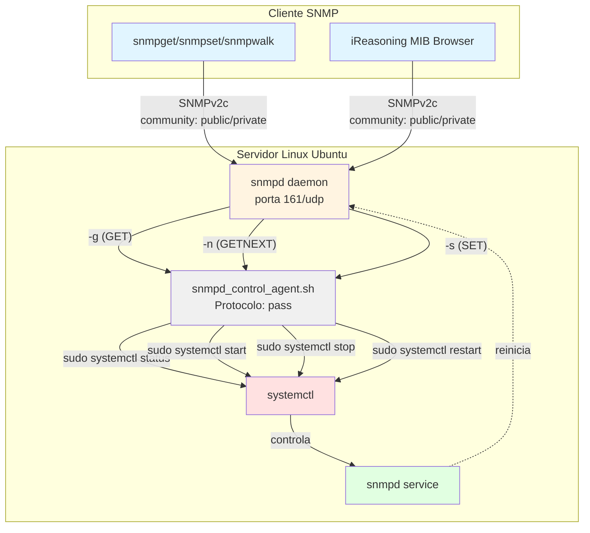
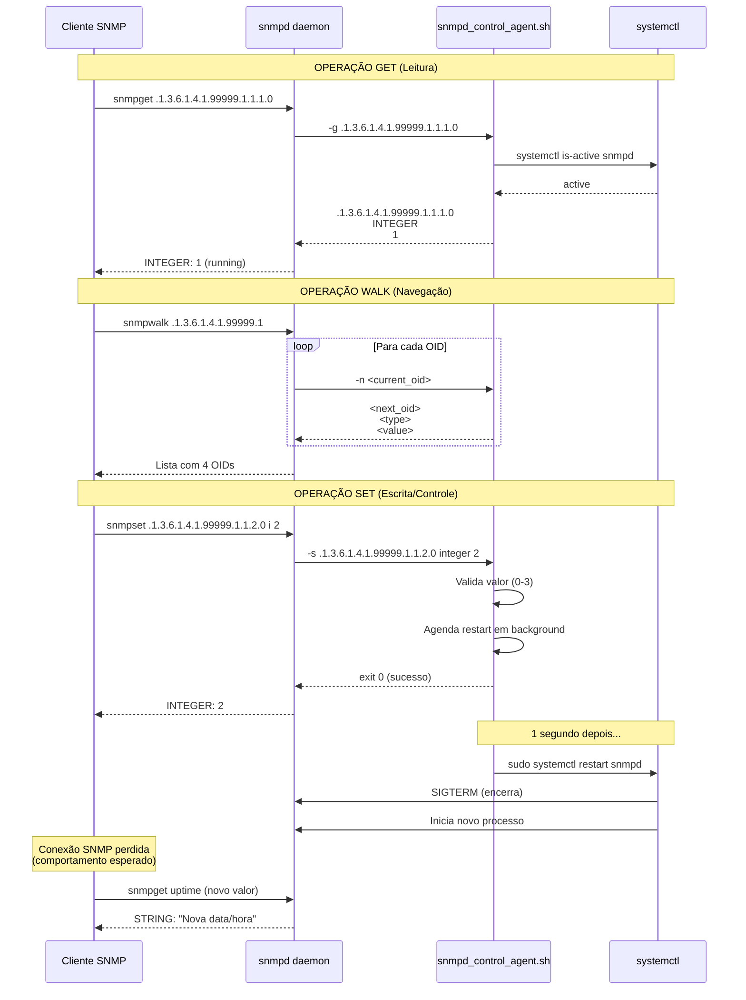

# Tarefa 01: CUSTOM-CONTROL-MIB - Controle do Serviço snmpd via SNMP

## Descrição

MIB customizada que permite gerenciar o serviço snmpd através de operações SNMP (GET, WALK, SET). Implementa 4 objetos gerenciados usando protocolo **pass** (não pass_persist).

| OID | Nome | Tipo | Acesso | Descrição |
|-----|------|------|--------|-----------|
| .1.3.6.1.4.1.99999.1.1.1.0 | `snmpdStatus` | INTEGER | READ-ONLY | Status: 0=unknown, 1=running, 2=stopped |
| .1.3.6.1.4.1.99999.1.1.2.0 | `snmpdControl` | INTEGER | READ-WRITE | Controle: 0=noop, 1=stop, 2=restart, 3=start |
| .1.3.6.1.4.1.99999.1.1.3.0 | `snmpdUptime` | DisplayString | READ-ONLY | Data/hora início do serviço |
| .1.3.6.1.4.1.99999.1.1.4.0 | `snmpdVersion` | DisplayString | READ-ONLY | Versão do Net-SNMP |

## Diagrama do Cenário



### Fluxo de Operações



## Status de Validação

**FUNCIONANDO 100%** - Testado em Ubuntu Linux com Net-SNMP 5.9.4:

| Operação | CLI (snmpget/set/walk) | iReasoning MIB Browser | Status |
|----------|------------------------|------------------------|--------|
| **GET** | ✅ Funcionando | ✅ Funcionando | 100% |
| **WALK** | ✅ Funcionando | ✅ Funcionando | 100% |
| **SET** | ✅ Funcionando | ✅ Funcionando* | 100% |

\* *SET via iReasoning pode mostrar erro "No Such Name" ao reiniciar snmpd (conexão interrompida). Validar sucesso pela mudança de uptime.*

## Arquivos do Projeto

```
Tarefa01_MIB_Control/
├── CUSTOM-CONTROL-MIB.txt                  # MIB formal SMIv2 (RFC 2578)
├── snmpd_control_agent.sh                  # Agente pass para snmpd
├── snmpd.conf.example                      # Configuração snmpd de referência
├── sudoers-snmpd-control.example           # Permissões sudo necessárias
├── teste_completo.sh                       # Script de validação automática
├── GUIA_iReasoning_MIB_Browser.md         # Guia do MIB Browser
├── INSTALL_QUICK.md                        # Guia de instalação rápida
└── README.md                               # Este arquivo
```

---

## GUIA DE INSTALAÇÃO PASSO A PASSO

### Pré-requisitos
- Ubuntu 20.04+ (ou Debian-based)
- Acesso sudo
- Conexão com internet

---

### PASSO 1: Instalar Net-SNMP

```bash
sudo apt-get update
sudo apt-get install -y snmpd snmp libsnmp-dev
```

**Verificar instalação:**
```bash
snmpd -v
# Saída esperada: NET-SNMP version:  5.9.x
```

---

### PASSO 2: Instalar a MIB Customizada

```bash
# Copiar MIB para diretório padrão
sudo cp CUSTOM-CONTROL-MIB.txt /usr/share/snmp/mibs/

# Verificar
ls -l /usr/share/snmp/mibs/CUSTOM-CONTROL-MIB.txt
```

---

### PASSO 3: Instalar o Agente Pass

```bash
# Copiar script do agente
sudo cp snmpd_control_agent.sh /usr/local/bin/

# Dar permissão de execução
sudo chmod +x /usr/local/bin/snmpd_control_agent.sh

# Verificar
ls -l /usr/local/bin/snmpd_control_agent.sh
# Deve mostrar: -rwxr-xr-x
```

---

### PASSO 4: Configurar Permissões Sudo

**CRÍTICO**: O agente precisa de permissões para controlar o systemctl.

```bash
# Criar arquivo sudoers
sudo bash -c 'cat > /etc/sudoers.d/snmpd-control << EOF
# Permitir usuário Debian-snmp executar systemctl para snmpd
Debian-snmp ALL=(ALL) NOPASSWD: /bin/systemctl start snmpd, /bin/systemctl stop snmpd, /bin/systemctl restart snmpd
EOF'

# Definir permissões corretas (OBRIGATÓRIO)
sudo chmod 0440 /etc/sudoers.d/snmpd-control

# Validar sintaxe
sudo visudo -c
# Deve retornar: parsed OK
```

**Testar permissões:**
```bash
sudo -u Debian-snmp sudo systemctl status snmpd
# Não deve pedir senha
```

---

### PASSO 5: Configurar snmpd.conf

**IMPORTANTE**: Fazer backup do arquivo original antes de modificar.

```bash
# Backup do arquivo original
sudo cp /etc/snmp/snmpd.conf /etc/snmp/snmpd.conf.backup

# Adicionar configurações necessárias
sudo bash -c 'cat >> /etc/snmp/snmpd.conf << EOF

# ==================================================================
# CUSTOM-CONTROL-MIB Configuration
# ==================================================================

# Views - Permitir acesso ao OID customizado
view   systemonly  included   .1.3.6.1.4.1.99999

# Comunidades SNMP
rocommunity public localhost -V systemonly
rwcommunity private localhost -V systemonly

# Agente pass (não pass_persist)
pass .1.3.6.1.4.1.99999.1 /usr/local/bin/snmpd_control_agent.sh

# ==================================================================
EOF'
```

**Verificar configuração:**
```bash
sudo grep -A5 "CUSTOM-CONTROL-MIB" /etc/snmp/snmpd.conf
```

---

### PASSO 6: Reiniciar e Verificar snmpd

```bash
# Reiniciar serviço
sudo systemctl restart snmpd

# Verificar status
sudo systemctl status snmpd
# Deve mostrar: active (running)

# Verificar logs (se houver erro)
sudo journalctl -u snmpd -n 20 --no-pager
```

---

### PASSO 7: Validar Instalação

#### Teste Rápido:
```bash
# GET - Status do snmpd
snmpget -v2c -c public localhost .1.3.6.1.4.1.99999.1.1.1.0
# Esperado: INTEGER: 1 (running)

# WALK - Todos os objetos
snmpwalk -v2c -c public localhost .1.3.6.1.4.1.99999.1
# Esperado: 4 OIDs listados
```

#### Teste Completo Automatizado:
```bash
cd ~/Projetos/Gerencia_de_Redes/HandsOn/Tarefa01_MIB_Control
chmod +x teste_completo.sh
./teste_completo.sh
```

---

---

## TESTES DETALHADOS

### Teste 1: GET - Ler Status do Serviço

```bash
# Status (1=running, 2=stopped)
snmpget -v2c -c public localhost .1.3.6.1.4.1.99999.1.1.1.0

# Control (sempre retorna 0=noop na leitura)
snmpget -v2c -c public localhost .1.3.6.1.4.1.99999.1.1.2.0

# Uptime (data/hora de início)
snmpget -v2c -c public localhost .1.3.6.1.4.1.99999.1.1.3.0

# Versão do Net-SNMP
snmpget -v2c -c public localhost .1.3.6.1.4.1.99999.1.1.4.0
```

**Resultado Esperado:**
```
iso.3.6.1.4.1.99999.1.1.1.0 = INTEGER: 1
iso.3.6.1.4.1.99999.1.1.2.0 = INTEGER: 0
iso.3.6.1.4.1.99999.1.1.3.0 = STRING: "Sat 2026-01-17 18:27:00 -03"
iso.3.6.1.4.1.99999.1.1.4.0 = STRING: "5.9"
```

---

### Teste 2: WALK - Navegar Árvore OID

```bash
snmpwalk -v2c -c public localhost .1.3.6.1.4.1.99999.1
```

**Resultado Esperado:**
```
iso.3.6.1.4.1.99999.1.1.1.0 = INTEGER: 1
iso.3.6.1.4.1.99999.1.1.2.0 = INTEGER: 0
iso.3.6.1.4.1.99999.1.1.3.0 = STRING: "Sat 2026-01-17 18:27:00 -03"
iso.3.6.1.4.1.99999.1.1.4.0 = STRING: "5.9"
```

---

### Teste 3: SET - Controlar Serviço (RESTART)

**IMPORTANTE**: Este teste reinicia o snmpd!

```bash
# 1. Anotar uptime ANTES
echo "Uptime ANTES:"
snmpget -v2c -c public localhost .1.3.6.1.4.1.99999.1.1.3.0

# 2. Executar RESTART (valor 2)
snmpset -v2c -c private localhost .1.3.6.1.4.1.99999.1.1.2.0 i 2

# 3. Aguardar restart
sleep 5

# 4. Verificar uptime DEPOIS
echo "Uptime DEPOIS:"
snmpget -v2c -c public localhost .1.3.6.1.4.1.99999.1.1.3.0
```

**Validação de Sucesso:**
- ✅ Uptime mudou (data/hora diferente)
- ✅ Log criado em `/tmp/snmp_set.log`

---

### Teste 4: Verificar Logs do Agente

```bash
# Ver log das operações SET
cat /tmp/snmp_set.log

# Exemplo de saída:
# Sat Jan 17 06:26:58 PM -03 2026: SET OID=.1.3.6.1.4.1.99999.1.1.2.0 VALUE=2
# Sat Jan 17 06:26:58 PM -03 2026: Executing RESTART
```

---

## TESTANDO COM iReasoning MIB BROWSER

### Instalação do iReasoning (Opcional)

```bash
# Se já não tiver instalado
cd ~/Downloads
# Baixar de: https://www.ireasoning.com/mibbrowser.shtml
unzip mibbrowser_linux_x64.zip
cd ireasoning/mibbrowser

# Copiar MIB
cp ~/Projetos/Gerencia_de_Redes/HandsOn/Tarefa01_MIB_Control/CUSTOM-CONTROL-MIB.txt mibs/

# Iniciar
./browser.sh
```

### Configuração Obrigatória no iReasoning

**CRÍTICO**: Sem estas configurações, o SET não funcionará!

```
┌─────────────────────────────────────────────────┐
│ Address: localhost                              │
│ Port: 161                                       │
│ Version: SNMPv2c  ⬅️ IMPORTANTE (não v1)       │
│ Read Community:  public                         │
│ Write Community: private  ⬅️ OBRIGATÓRIO!      │
│ Timeout: 5000                                   │
│ Retries: 3                                      │
└─────────────────────────────────────────────────┘
```

### Passo a Passo no iReasoning

1. **Carregar MIB:**
   - `File` → `Load MIB File...`
   - Selecionar `CUSTOM-CONTROL-MIB.txt`
   - Aguardar compilação

2. **Navegar na Árvore:**
   ```
   .iso (1)
     └─ .org (3)
         └─ .dod (6)
             └─ .internet (1)
                 └─ .private (4)
                     └─ .enterprises (1)
                         └─ .99999
                             └─ .customControlModule (1)
                                 └─ .snmpdObjects (1)
   ```

3. **Testar GET:**
   - Clicar em `snmpdStatus`
   - Botão direito → `Operations` → `Get`
   - Verificar resultado

4. **Testar WALK:**
   - Clicar em `snmpdObjects`
   - Botão direito → `Operations` → `Walk`
   - Ver todos os 4 objetos

5. **Testar SET:**
   - Anotar uptime ANTES
   - Clicar em `snmpdControl`
   - Botão direito → `Operations` → `Set`
   - Type: `INTEGER`, Value: `2`
   - Clicar `OK`
   - **Aguardar 10 segundos**
   - Verificar uptime DEPOIS (deve ter mudado)

### Comportamento Esperado do SET

O iReasoning pode mostrar erro **"No Such Name"** após executar SET de restart. **Isto é NORMAL** porque:

1. ✅ O comando SET é recebido e executado
2. ✅ O script agenda restart para 1 segundo depois
3. ⚠️ O snmpd reinicia interrompendo a conexão
4. ❌ iReasoning interpreta desconexão como erro

**Validação:** Comparar uptime ANTES vs DEPOIS. Se mudou = **SUCESSO!**

---

## TROUBLESHOOTING

### Problema 1: "Timeout: No Response"

**Causa**: snmpd não está rodando ou firewall bloqueando.

**Solução:**
```bash
# Verificar se snmpd está ativo
sudo systemctl status snmpd

# Se não estiver, iniciar
sudo systemctl start snmpd

# Verificar firewall
sudo ufw status
# Se ativo, permitir porta 161
sudo ufw allow 161/udp
```

---

### Problema 2: "No Such Object available"

**Causa**: OID customizado não está na view do snmpd.conf.

**Solução:**
```bash
# Verificar se view inclui .1.3.6.1.4.1.99999
sudo grep "view.*99999" /etc/snmp/snmpd.conf

# Se não encontrar, adicionar:
sudo bash -c 'echo "view   systemonly  included   .1.3.6.1.4.1.99999" >> /etc/snmp/snmpd.conf'

# Reiniciar snmpd
sudo systemctl restart snmpd
```

---

### Problema 3: "notWritable" no SET

**Causa**: rwcommunity não está configurada corretamente.

**Solução:**
```bash
# Verificar rwcommunity
sudo grep "rwcommunity" /etc/snmp/snmpd.conf

# Deve ter:
# rwcommunity private localhost -V systemonly

# Se não tiver a view (-V systemonly), corrigir:
sudo sed -i 's/^rwcommunity private localhost$/rwcommunity private localhost -V systemonly/' /etc/snmp/snmpd.conf

# Reiniciar
sudo systemctl restart snmpd
```

---

### Problema 4: SET não executa restart

**Causa**: Permissões sudo não configuradas.

**Solução:**
```bash
# Testar permissões
sudo -u Debian-snmp sudo systemctl status snmpd

# Se pedir senha, reconfigurar sudoers:
sudo bash -c 'cat > /etc/sudoers.d/snmpd-control << EOF
Debian-snmp ALL=(ALL) NOPASSWD: /bin/systemctl start snmpd, /bin/systemctl stop snmpd, /bin/systemctl restart snmpd
EOF'

sudo chmod 0440 /etc/sudoers.d/snmpd-control
sudo visudo -c
```

---

### Problema 5: Script não é executado

**Causa**: Permissão de execução ou caminho incorreto.

**Solução:**
```bash
# Verificar permissões
ls -l /usr/local/bin/snmpd_control_agent.sh
# Deve mostrar: -rwxr-xr-x

# Se não tiver permissão
sudo chmod +x /usr/local/bin/snmpd_control_agent.sh

# Testar manualmente
/usr/local/bin/snmpd_control_agent.sh -g .1.3.6.1.4.1.99999.1.1.1.0
# Deve retornar: OID, tipo e valor

# Verificar configuração no snmpd.conf
sudo grep "pass.*99999" /etc/snmp/snmpd.conf
# Deve ter: pass .1.3.6.1.4.1.99999.1 /usr/local/bin/snmpd_control_agent.sh
```

---

### Problema 6: iReasoning SET não funciona

**Causa**: Write Community não preenchida ou versão SNMP incorreta.

**Checklist iReasoning:**
- [ ] Version: **SNMPv2c** (não v1)
- [ ] Read Community: **public**
- [ ] Write Community: **private** ⬅️ OBRIGATÓRIO
- [ ] Timeout: mínimo **5000ms**

**Teste CLI para comparar:**
```bash
# Se funcionar via CLI, problema é no iReasoning
snmpset -v2c -c private localhost .1.3.6.1.4.1.99999.1.1.2.0 i 2
```

---

## ARQUITETURA TÉCNICA

### Protocolo pass vs pass_persist

Este projeto usa `pass` (não `pass_persist`) porque:

✅ **pass**: Script executado a cada operação (one-shot)
- Parâmetros: `-g` (GET), `-n` (GETNEXT), `-s` (SET)
- Mais simples e estável para operações que reiniciam serviços
- **Usado neste projeto**

❌ **pass_persist**: Processo persistente com stdin/stdout
- Protocolo: PING/PONG, get/getnext/set via stdin
- Mais eficiente mas complexo
- Problemas ao reiniciar o próprio snmpd

### Fluxo de Operações

#### GET:
```
snmpget → snmpd → script -g OID → retorna valor → snmpd → resposta
```

#### WALK:
```
snmpwalk → snmpd → múltiplos -n OID → script → próximo OID
```

#### SET:
```
snmpset → snmpd → script -s OID TYPE VALUE → 
  → agenda restart (sleep 1)
  → retorna sucesso
  → 1 segundo depois: systemctl restart
```

### Estrutura do Agente

```bash
snmpd_control_agent.sh:
│
├── if [ "$1" = "-g" ]  # GET operation
│   ├── Lê valor do systemctl
│   └── Retorna: OID\nTYPE\nVALUE
│
├── elif [ "$1" = "-n" ]  # GETNEXT operation  
│   ├── Determina próximo OID
│   └── Retorna: NEXT_OID\nTYPE\nVALUE
│
└── elif [ "$1" = "-s" ]  # SET operation
    ├── Valida valor (0-3)
    ├── Agenda execução: (sleep 1; sudo systemctl ...)&
    └── Retorna: exit 0 (sucesso)
```

---

## REFERÊNCIAS

- **RFC 2578**: Structure of Management Information Version 2 (SMIv2)
- **RFC 2579**: Textual Conventions for SMIv2  
- **RFC 2580**: Conformance Statements for SMIv2
- **Net-SNMP**: http://www.net-snmp.org/docs/
- **snmpd.conf(5)**: man page configuração do snmpd
- **snmpd.examples(5)**: man page com exemplos de configuração

---

## AUTORES

- **ANTONIA MAYARA DA SILVA NASCIMENTO**
- **JOÃO BATISTA DE SANTANA SILVA**  
- **Marcos Dantas Ortiz**

**Instituição**: Mestrado e Doutorado em Ciência da Computação (MDCC) - UFC  
**Disciplina**: Gerência de Redes de Computadores  
**Professor**: José Neuman  
**Data**: Janeiro 2026  
**Versão**: 1.0 (Validada e Testada)

---

## CHECKLIST DE VALIDAÇÃO

Use este checklist para validar a instalação:

- [ ] Net-SNMP instalado (`snmpd -v` funciona)
- [ ] MIB copiada para `/usr/share/snmp/mibs/`
- [ ] Agente copiado para `/usr/local/bin/` com permissão `+x`
- [ ] Sudoers configurado em `/etc/sudoers.d/snmpd-control` (modo 0440)
- [ ] `visudo -c` retorna "parsed OK"
- [ ] snmpd.conf contém view para `.1.3.6.1.4.1.99999`
- [ ] snmpd.conf contém `rocommunity public localhost -V systemonly`
- [ ] snmpd.conf contém `rwcommunity private localhost -V systemonly`
- [ ] snmpd.conf contém `pass .1.3.6.1.4.1.99999.1 /usr/local/bin/snmpd_control_agent.sh`
- [ ] snmpd reiniciado: `sudo systemctl restart snmpd`
- [ ] snmpd ativo: `sudo systemctl status snmpd` mostra "active (running)"
- [ ] GET funciona: `snmpget -v2c -c public localhost .1.3.6.1.4.1.99999.1.1.1.0`
- [ ] WALK funciona: `snmpwalk -v2c -c public localhost .1.3.6.1.4.1.99999.1`
- [ ] SET funciona: uptime muda após `snmpset -v2c -c private localhost .1.3.6.1.4.1.99999.1.1.2.0 i 2`
- [ ] Log criado: `/tmp/snmp_set.log` existe após SET

---

## RESULTADO ESPERADO

Após instalação completa, você deve conseguir:

1. ✅ **Ler status do snmpd** via SNMP
2. ✅ **Navegar árvore OID** customizada
3. ✅ **Controlar serviço snmpd** (stop/start/restart) via SNMP SET
4. ✅ **Validar mudanças** através do uptime
5. ✅ **Usar MIB Browser** (iReasoning) para operações gráficas

**Tempo estimado de instalação**: 15-20 minutos  
**Dificuldade**: Intermediária  
**Pré-requisitos**: Conhecimentos básicos de Linux e SNMP

### 4. Configurar Sudoers
```bash
sudo cp sudoers-snmpd-control.example /etc/sudoers.d/snmpd-control
sudo chmod 0440 /etc/sudoers.d/snmpd-control
sudo visudo -c  # Verificar sintaxe
```

### 5. Configurar snmpd
Adicionar ao `/etc/snmp/snmpd.conf`:

```conf
# Views
view   systemonly  included   .1.3.6.1.2.1.1
view   systemonly  included   .1.3.6.1.2.1.25.1
view   systemonly  included   .1.3.6.1.4.1.99999      # CUSTOM OID

# Comunidades
rocommunity public localhost -V systemonly             # Leitura
rwcommunity private localhost -V systemonly            # Escrita

# Agente pass
pass .1.3.6.1.4.1.99999.1 /usr/local/bin/snmpd_control_agent.sh
```

### 6. Reiniciar snmpd
```bash
sudo systemctl restart snmpd
sudo systemctl status snmpd
```

## Testes

### Teste 1: GET (Ler Status)
```bash
snmpget -v2c -c public localhost .1.3.6.1.4.1.99999.1.1.1.0
# Resultado esperado: INTEGER: 1 (running)

snmpget -v2c -c public localhost .1.3.6.1.4.1.99999.1.1.3.0
# Resultado esperado: STRING: "Sat 2026-01-17 10:11:05 -03"
```

### Teste 2: WALK (Navegar Árvore)
```bash
snmpwalk -v2c -c public localhost .1.3.6.1.4.1.99999.1
# Resultado esperado: Lista de 4 OIDs
```

### Teste 3: SET (Controlar Serviço)
```bash
# Verificar uptime ANTES
snmpget -v2c -c public localhost .1.3.6.1.4.1.99999.1.1.3.0

# Executar RESTART (valor 2)
snmpset -v2c -c private localhost .1.3.6.1.4.1.99999.1.1.2.0 i 2

# Aguardar 5 segundos
sleep 5

# Verificar uptime DEPOIS (deve ter mudado)
snmpget -v2c -c public localhost .1.3.6.1.4.1.99999.1.1.3.0
```

### Teste 4: GET Múltiplo
```bash
snmpget -v2c -c public localhost \
  .1.3.6.1.4.1.99999.1.1.1.0 \
  .1.3.6.1.4.1.99999.1.1.2.0 \
  .1.3.6.1.4.1.99999.1.1.3.0 \
  .1.3.6.1.4.1.99999.1.1.4.0
```

## Resultados dos Testes (17/Jan/2026)

```
=== TESTE FINAL TAREFA 01 ===

1. GET Todos os OIDs:
iso.3.6.1.4.1.99999.1.1.1.0 = INTEGER: 1
iso.3.6.1.4.1.99999.1.1.2.0 = INTEGER: 0
iso.3.6.1.4.1.99999.1.1.3.0 = STRING: "Sat 2026-01-17 10:11:05 -03"
iso.3.6.1.4.1.99999.1.1.4.0 = ""

2. WALK da árvore OID:
iso.3.6.1.4.1.99999.1.1.1.0 = INTEGER: 1
iso.3.6.1.4.1.99999.1.1.2.0 = INTEGER: 0
iso.3.6.1.4.1.99999.1.1.3.0 = STRING: "Sat 2026-01-17 10:11:05 -03"
iso.3.6.1.4.1.99999.1.1.4.0 = ""

3. SET restart - Uptime ANTES:
iso.3.6.1.4.1.99999.1.1.3.0 = STRING: "Sat 2026-01-17 10:11:05 -03"

Executando SET restart (valor 2)...
iso.3.6.1.4.1.99999.1.1.2.0 = INTEGER: 2

Uptime DEPOIS (deve ter mudado):
iso.3.6.1.4.1.99999.1.1.3.0 = STRING: "Sat 2026-01-17 10:14:28 -03"
```

**VALIDAÇÃO**: Uptime mudou de `10:11:05` para `10:14:28` confirmando que o restart foi executado!

## Detalhes Técnicos

### Protocolo pass
- O snmpd executa scripts externos via protocolo `pass` (one-shot)
- Parâmetros:
  - `-g OID`: GET - Ler valor
  - `-n OID`: GETNEXT - Próximo OID
  - `-s OID TYPE VALUE`: SET - Escrever valor

### Controle via sudo
- O agente roda como usuário `Debian-snmp`
- Precisa de permissões sudo para controlar systemctl
- Configuração em `/etc/sudoers.d/snmpd-control`
- NOPASSWD: Permite execução sem senha

### Execução em Background
- Comandos systemctl executados com `(sleep 1; comando) &`
- Sleep de 1 segundo evita terminação prematura do script
- Permite que SET retorne antes do restart completar

## Troubleshooting

### Problema: "No Such Object available"
**Solução**: Verificar se OID está incluído na view:
```bash
sudo grep "view.*systemonly" /etc/snmp/snmpd.conf
# Deve conter: view systemonly included .1.3.6.1.4.1.99999
```

### Problema: "notWritable"
**Solução**: Verificar rwcommunity com view:
```bash
sudo grep "rwcommunity" /etc/snmp/snmpd.conf
# Deve ser: rwcommunity private localhost -V systemonly
```

### Problema: SET não executa restart
**Solução 1**: Verificar permissões sudo:
```bash
sudo -u Debian-snmp sudo systemctl restart snmpd
```

**Solução 2**: Verificar logs:
```bash
cat /tmp/snmp_set.log
```

### Problema: WALK retorna "No more variables"
**Solução**: Script GETNEXT deve tratar todos os casos de OID, incluindo base sem sufix (.1.3.6.1.4.1.99999.1)

## Referências

- RFC 2578: Structure of Management Information Version 2 (SMIv2)
- RFC 2579: Textual Conventions for SMIv2
- RFC 2580: Conformance Statements for SMIv2
- Net-SNMP Documentation: http://www.net-snmp.org/docs/
- snmpd.conf(5): man page para configuração do snmpd