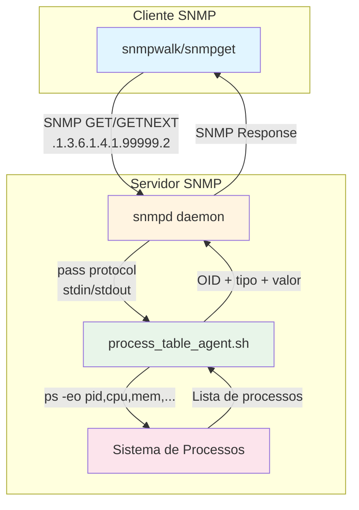
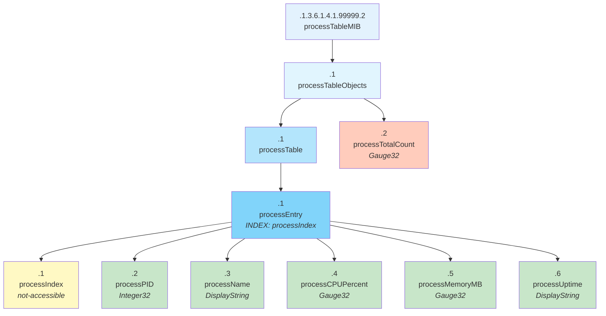
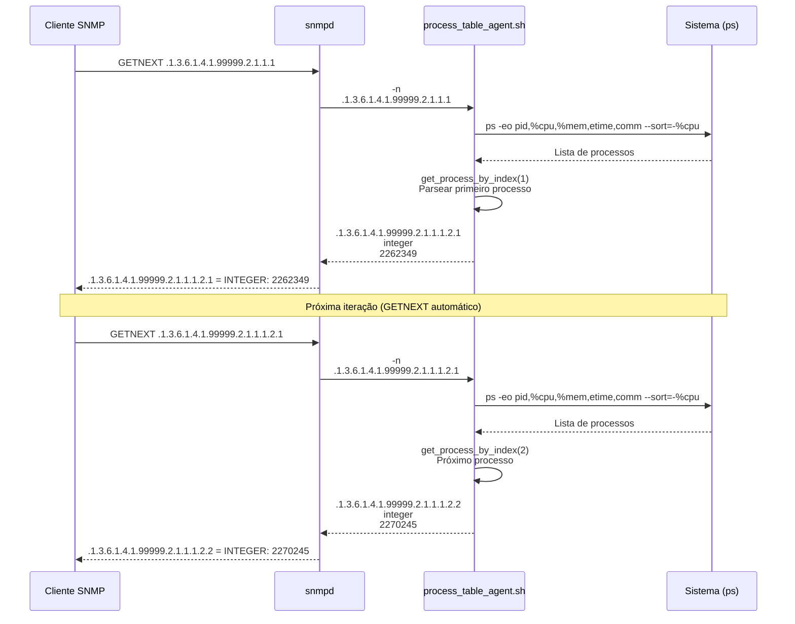
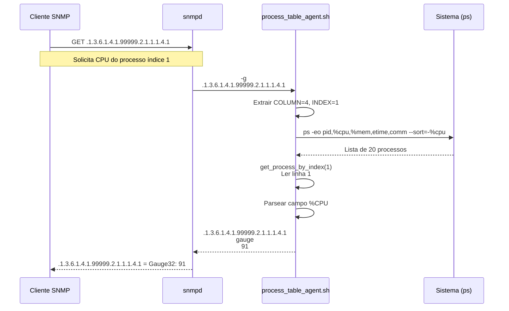
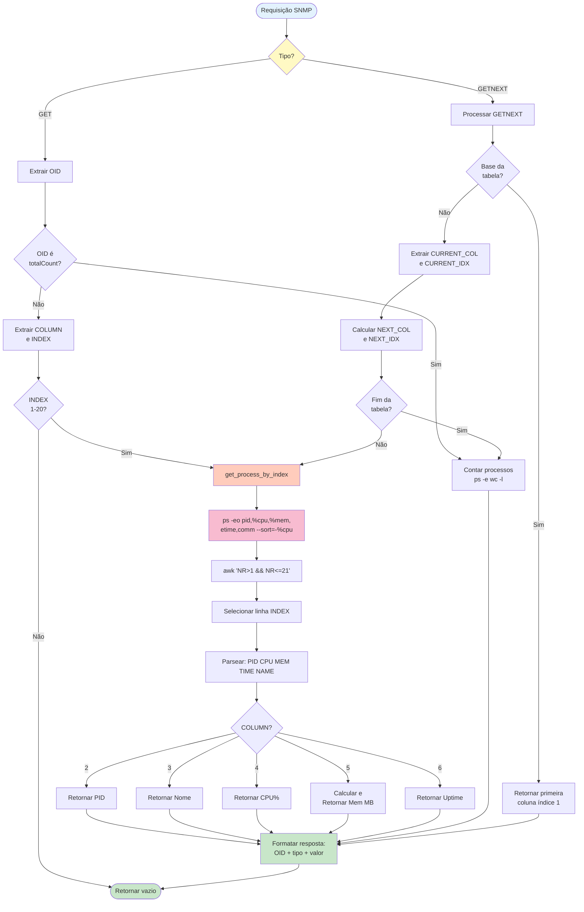

# Tarefa 02: Tabela de Processos SNMP

## Descrição
Implementação de uma tabela SNMP customizada para listar e monitorar processos em execução no sistema. Esta tarefa demonstra o uso de estruturas de dados complexas (tabelas) em MIBs SNMP.

## Arquitetura do Sistema



## Funcionalidades

A tabela de processos fornece as seguintes informações para cada processo:

1. **PID** (Process ID) - Identificador único do processo
2. **Nome** - Nome do comando/executável
3. **CPU (%)** - Uso de CPU em percentual
4. **Memória (MB)** - Uso de memória RAM em Megabytes
5. **Uptime** - Tempo de execução no formato HH:MM:SS

## Arquivos

```
Tarefa02_Tabela_Processos/
├── PROCESS-TABLE-MIB.txt     # Definição da MIB
├── process_table_agent.sh     # Agente SNMP em bash
└── README.md                  # Esta documentação
```

## Instalação

### 1. Instalar Net-SNMP

**Ubuntu/Debian:**
```bash
sudo apt-get update
sudo apt-get install snmpd snmp snmp-mibs-downloader
```

**RedHat/CentOS:**
```bash
sudo yum install net-snmp net-snmp-utils
```

**MacOS:**
```bash
brew install net-snmp
```

### 2. Copiar a MIB

**Linux:**
```bash
sudo cp PROCESS-TABLE-MIB.txt /usr/share/snmp/mibs/
# ou
mkdir -p ~/.snmp/mibs
cp PROCESS-TABLE-MIB.txt ~/.snmp/mibs/
```

**MacOS:**
```bash
mkdir -p ~/.snmp/mibs
cp PROCESS-TABLE-MIB.txt ~/.snmp/mibs/
```

### 3. Instalar o agente

```bash
# Copiar script para local apropriado
sudo cp process_table_agent.sh /usr/local/bin/
sudo chmod +x /usr/local/bin/process_table_agent.sh
```

### 4. Configurar snmpd

Adicione a seguinte linha ao arquivo `/etc/snmp/snmpd.conf`:

```bash
pass .1.3.6.1.4.1.99999.2 /usr/local/bin/process_table_agent.sh
```

**Nota**: O OID `.1.3.6.1.4.1.99999.2` corresponde ao `processTableMIB`.

**Importante**: Certifique-se de que a VIEW permite acesso ao OID:
```bash
# Adicionar ao snmpd.conf se necessário
view systemonly included .1.3.6.1.4.1.99999
```

### 5. Reiniciar snmpd

```bash
sudo systemctl restart snmpd

# Verificar se está rodando
sudo systemctl status snmpd
```

## Como Testar

### Teste 1: Listar todos os processos

```bash
# Listar toda a tabela
snmpwalk -v2c -c public localhost .1.3.6.1.4.1.99999.2

# Ou usando nome da MIB (mais legível)
snmpwalk -v2c -c public -m +PROCESS-TABLE-MIB localhost PROCESS-TABLE-MIB::processTable
```

**Saída esperada:**
```
PROCESS-TABLE-MIB::processPID.1 = INTEGER: 1
PROCESS-TABLE-MIB::processName.1 = STRING: "systemd"
PROCESS-TABLE-MIB::processCPU.1 = INTEGER: 0
PROCESS-TABLE-MIB::processMemory.1 = INTEGER: 15
PROCESS-TABLE-MIB::processUptime.1 = STRING: "125:34:21"
PROCESS-TABLE-MIB::processPID.475 = INTEGER: 475
PROCESS-TABLE-MIB::processName.475 = STRING: "snapd"
...
```

### Teste 2: Consultar processo específico por PID

```bash
# Exemplo: Consultar processo com PID 1 (systemd)
snmpget -v2c -c public localhost \
    .1.3.6.1.4.1.99999.2.1.1.1.1 \
    .1.3.6.1.4.1.99999.2.1.1.2.1 \
    .1.3.6.1.4.1.99999.2.1.1.3.1 \
    .1.3.6.1.4.1.99999.2.1.1.4.1 \
    .1.3.6.1.4.1.99999.2.1.1.5.1
```

Ou usando nomes (mais legível):
```bash
snmpget -v2c -c public -m +PROCESS-TABLE-MIB localhost \
    PROCESS-TABLE-MIB::processPID.1 \
    PROCESS-TABLE-MIB::processName.1 \
    PROCESS-TABLE-MIB::processCPU.1 \
    PROCESS-TABLE-MIB::processMemory.1 \
    PROCESS-TABLE-MIB::processUptime.1
```

### Teste 3: Filtrar apenas nomes de processos

```bash
snmpwalk -v2c -c public -m +PROCESS-TABLE-MIB localhost PROCESS-TABLE-MIB::processName
```

### Teste 4: Filtrar apenas uso de CPU

```bash
snmpwalk -v2c -c public -m +PROCESS-TABLE-MIB localhost PROCESS-TABLE-MIB::processCPU
```

### Teste 5: Filtrar apenas uso de memória

```bash
snmpwalk -v2c -c public -m +PROCESS-TABLE-MIB localhost PROCESS-TABLE-MIB::processMemory
```

### Teste 6: Monitoramento contínuo

```bash
# Atualizar a cada 5 segundos
watch -n 5 'snmpwalk -v2c -c public -m +PROCESS-TABLE-MIB localhost PROCESS-TABLE-MIB::processTable'
```

### Teste 7: Validar a MIB

```bash
# Verificar sintaxe
smilint -l 3 PROCESS-TABLE-MIB.txt

# Traduzir OID para nome
snmptranslate -m +PROCESS-TABLE-MIB -On PROCESS-TABLE-MIB::processTable

# Ver estrutura da tabela
snmptranslate -m +PROCESS-TABLE-MIB -Tp -IR processTableMIB
```

## Estrutura da Tabela



### OIDs

```
.1.3.6.1.4.1.99999.2           # processTableMIB
└── .1                          # processTableObjects
    ├── .1                      # processTable
    │   └── .1                  # processEntry
    │       ├── .1.[INDEX]      # processIndex (not-accessible)
    │       ├── .2.[INDEX]      # processPID
    │       ├── .3.[INDEX]      # processName
    │       ├── .4.[INDEX]      # processCPUPercent
    │       ├── .5.[INDEX]      # processMemoryMB
    │       └── .6.[INDEX]      # processUptime
    └── .2                      # processTotalCount
```

**Nota**: A tabela usa índices sequenciais (1-20) mapeados para os 20 processos com maior uso de CPU.

### Colunas da Tabela

| Coluna | OID | Tipo | Acesso | Descrição |
|--------|-----|------|--------|-----------|
| processIndex | .1.3.6.1.4.1.99999.2.1.1.1.1 | Integer32 (1..20) | not-accessible | Índice sequencial (1-20) |
| processPID | .1.3.6.1.4.1.99999.2.1.1.1.2 | Integer32 | read-only | Process ID real |
| processName | .1.3.6.1.4.1.99999.2.1.1.1.3 | DisplayString | read-only | Nome do comando |
| processCPUPercent | .1.3.6.1.4.1.99999.2.1.1.1.4 | Gauge32 | read-only | % CPU (0-100) |
| processMemoryMB | .1.3.6.1.4.1.99999.2.1.1.1.5 | Gauge32 | read-only | Memória em MB |
| processUptime | .1.3.6.1.4.1.99999.2.1.1.1.6 | DisplayString | read-only | Tempo no formato HH:MM:SS |

## Fluxo de Comunicação SNMP

### Sequência de uma Consulta GETNEXT



### Sequência de uma Consulta GET



### Colunas da Tabela (Legado - será removido)

| Coluna | OID | Tipo | Acesso | Descrição |
|--------|-----|------|--------|-----------|
| processPID | .1.3.6.1.4.1.99999.2.1.1.1 | Integer32 | read-only | Process ID (índice) |
| processName | .1.3.6.1.4.1.99999.2.1.1.2 | DisplayString | read-only | Nome do comando |
| processCPU | .1.3.6.1.4.1.99999.2.1.1.3 | Integer32 | read-only | % CPU (0-100) |
| processMemory | .1.3.6.1.4.1.99999.2.1.1.4 | Integer32 | read-only | Memória em MB |
| processUptime | .1.3.6.1.4.1.99999.2.1.1.5 | DisplayString | read-only | Tempo no formato HH:MM:SS |

## Exemplo de Saída Formatada

```bash
# Script para exibir de forma legível
snmpwalk -v2c -c public -m +PROCESS-TABLE-MIB localhost PROCESS-TABLE-MIB::processTable | \
awk '
/processPID/ {pid=$4}
/processName/ {name=$4; gsub(/"/, "", name)}
/processCPU/ {cpu=$4}
/processMemory/ {mem=$4}
/processUptime/ {uptime=$4; gsub(/"/, "", uptime); 
    printf "PID: %5s | Nome: %-20s | CPU: %3s%% | Mem: %5sMB | Uptime: %s\n", 
    pid, name, cpu, mem, uptime
}
'
```

**Resultado:**
```
PID:     1 | Nome: systemd              | CPU:   0% | Mem:    15MB | Uptime: 125:34:21
PID:   475 | Nome: snapd                | CPU:   0% | Mem:    45MB | Uptime: 125:30:15
PID:   892 | Nome: NetworkManager       | CPU:   1% | Mem:    32MB | Uptime: 125:25:10
PID:  1523 | Nome: gnome-shell          | CPU:  12% | Mem:   856MB | Uptime: 120:15:42
```

## Como Funciona

### Lógica do Agente



### Mecanismo pass

### Mecanismo pass

O protocolo **pass** executa um script externo para cada requisição SNMP:

1. **snmpd** recebe consulta SNMP do cliente
2. Identifica que o OID `.1.3.6.1.4.1.99999.2` está delegado ao agente externo
3. Executa `process_table_agent.sh` passando operação e OID via argumentos de linha de comando
4. Agente processa e retorna: `OID + tipo + valor` via stdout
5. **snmpd** formata e retorna resposta ao cliente SNMP

**Diferença entre pass e pass_persist**:
- `pass`: Nova execução do script a cada requisição (usado nesta implementação)
- `pass_persist`: Script roda continuamente, comunicação via stdin/stdout

### Protocolo de Comunicação

**Formato da chamada**:
```bash
/usr/local/bin/process_table_agent.sh -g <OID>  # Para GET
/usr/local/bin/process_table_agent.sh -n <OID>  # Para GETNEXT
```

**Formato da resposta** (3 linhas via stdout):
```
<OID_completo>
<tipo>
<valor>
```

**Exemplo GET**:

**Exemplo GET**:
```bash
# Chamada
$ /usr/local/bin/process_table_agent.sh -g .1.3.6.1.4.1.99999.2.1.1.1.2.1

# Resposta (stdout)
.1.3.6.1.4.1.99999.2.1.1.1.2.1
integer
2262349
```

**Exemplo GETNEXT**:
```bash
# Chamada  
$ /usr/local/bin/process_table_agent.sh -n .1.3.6.1.4.1.99999.2.1.1.1

# Resposta (stdout)
.1.3.6.1.4.1.99999.2.1.1.1.2.1
integer
2262349
```

### Implementação do Agente

O script `process_table_agent.sh` implementa:

1. **Funções auxiliares**:
   - `get_process_list()`: Obtém top 20 processos por CPU usando `ps` e `awk`
   - `get_process_by_index()`: Mapeia índice 1-20 para dados completos do processo
   - `calc_memory_mb()`: Converte % memória para MB
   - `format_uptime()`: Formata tempo de execução

2. **Função process_get()**: Trata requisições GET
   - Valida índice (1-20)
   - Obtém dados do processo via `get_process_by_index()`
   - Retorna coluna específica (PID, Nome, CPU, Memória, Uptime)

3. **Função process_getnext()**: Trata requisições GETNEXT
   - Identifica próximo OID na ordem lexicográfica
   - Navega entre colunas (2→3→4→5→6)
   - Navega entre índices (1→2→...→20)
   - Retorna contador ao final da tabela

**Ordem de navegação GETNEXT**:
```
.2.1 → .2.2 → ... → .2.20 →  (Coluna PID, índices 1-20)
.3.1 → .3.2 → ... → .3.20 →  (Coluna Nome, índices 1-20)
.4.1 → .4.2 → ... → .4.20 →  (Coluna CPU, índices 1-20)
.5.1 → .5.2 → ... → .5.20 →  (Coluna Memória, índices 1-20)
.6.1 → .6.2 → ... → .6.20 →  (Coluna Uptime, índices 1-20)
→ processTotalCount
```

## Detalhes de Implementação

### Problema: Broken Pipe

Durante o desenvolvimento, identificamos que comandos com pipes múltiplos causavam erro "Broken pipe" quando executados pelo usuário `Debian-snmp`:

```bash
# ❌ Problemático
ps ... | tail -n +2 | head -20   # tail: error writing 'standard output': Broken pipe
ps ... | sed '1d' | head -20     # sed: couldn't write items to stdout: Broken pipe
```

**Solução**: Usar `awk` para todas as operações em um único comando:
```bash
# ✅ Solução
ps -eo pid,%cpu,%mem,etime,comm --sort=-%cpu 2>/dev/null | awk 'NR>1 && NR<=21'
```

### Problema: Race Condition

Inicialmente, o agente fazia duas chamadas separadas:
1. `get_pid_by_index()` para obter o PID
2. `ps -p $PID` para obter dados do processo

Entre essas chamadas, o processo podia terminar, causando dados inconsistentes.

**Solução**: Função `get_process_by_index()` que retorna todos os dados em uma única chamada:
```bash
get_process_by_index() {
    local INDEX=$1
    get_process_list | awk -v idx=$INDEX 'NR==idx'
}
```

### Estrutura de Dados

**Lista de processos** (output de `ps`):
```
    PID  %CPU  %MEM     ELAPSED COMMAND
2262349  12.5   2.1       19:28 chrome
2270245   8.3   1.8       12:15 code
...
```

**Mapeamento Índice → Dados**:
- Índice 1 → Linha 2 do ps (primeira após cabeçalho)
- Índice 2 → Linha 3 do ps
- ...
- Índice 20 → Linha 21 do ps

## Plataformas Suportadas

### Linux
✅ Totalmente funcional
- Usa `ps aux` padrão
- Lê `/proc/uptime` para calcular tempo de sistema

### MacOS
✅ Funcional com limitações
- `ps aux` funciona mas formato pode variar
- Alguns campos podem ter valores aproximados
- Tempo de sistema obtido via `sysctl kern.boottime`

### Windows (WSL)
⚠️ Parcialmente funcional
- Mostra processos do WSL, não do Windows host
- Recomenda-se usar ferramenta nativa Windows SNMP

## Troubleshooting

### Timeout ao consultar

```bash
# Verificar se snmpd está rodando
sudo systemctl status snmpd

# Verificar logs
sudo tail -f /var/log/syslog | grep snmp

# Testar agente diretamente (deve retornar em < 1 segundo)
time /usr/local/bin/process_table_agent.sh -g .1.3.6.1.4.1.99999.2.1.1.1.2.1

# Verificar configuração de VIEW
sudo grep "view.*99999" /etc/snmp/snmpd.conf
```

### Tabela vazia

```bash
# Verificar se ps funciona
ps -eo pid,%cpu,%mem,etime,comm --sort=-%cpu | head -5

# Testar agente standalone com GET
/usr/local/bin/process_table_agent.sh -g .1.3.6.1.4.1.99999.2.1.1.1.2.1

# Testar agente standalone com GETNEXT
/usr/local/bin/process_table_agent.sh -n .1.3.6.1.4.1.99999.2.1.1.1
```

### MIB não carrega

```bash
# Verificar se arquivo existe
ls -l ~/.snmp/mibs/PROCESS-TABLE-MIB.txt

# Carregar explicitamente
export MIBS=+PROCESS-TABLE-MIB

# Testar tradução
snmptranslate -m +PROCESS-TABLE-MIB -On PROCESS-TABLE-MIB::processTable
```

### Agent não responde

```bash
# Verificar permissões
ls -l /usr/local/bin/process_table_agent.sh
sudo chmod +x /usr/local/bin/process_table_agent.sh

# Verificar configuração snmpd
grep "pass.*99999" /etc/snmp/snmpd.conf
# Deve mostrar: pass .1.3.6.1.4.1.99999.2 /usr/local/bin/process_table_agent.sh

# Testar agente diretamente
/usr/local/bin/process_table_agent.sh -n .1.3.6.1.4.1.99999.2.1.1.1

# Verificar sintaxe do script
bash -n /usr/local/bin/process_table_agent.sh

# Reiniciar snmpd
sudo systemctl restart snmpd
```

### Valores incorretos

```bash
# Verificar formato do ps
ps aux | head -5

# Se formato diferir, ajustar variáveis no script:
# COLUMN_PID, COLUMN_CPU, COLUMN_MEM, COLUMN_TIME, COLUMN_CMD
```

## Melhorias Possíveis

1. **Filtros**: Adicionar objetos para filtrar processos por usuário ou nome
2. **Controle**: Permitir matar processos via SNMP SET
3. **Estatísticas**: Adicionar total de processos, média de CPU/memória
4. **Cache**: Implementar cache com TTL para melhor performance
5. **Threads**: Incluir informação de threads por processo

## Conceitos Aprendidos

1. **SEQUENCE**: Definição de estrutura de entrada de tabela SNMP
2. **INDEX**: Indexação de tabelas por índice sequencial
3. **not-accessible**: Coluna usada apenas como índice, não retornada
4. **GETNEXT**: Navegação ordenada em estruturas complexas (tabelas)
5. **DisplayString**: Tipo de string legível (TEXTUAL-CONVENTION)
6. **Gauge32**: Tipo numérico não-cumulativo de 32 bits
7. **MAX-ACCESS read-only**: Controle de acesso somente leitura
8. **pass protocol**: Delegação de OIDs a agentes externos
9. **Broken pipe**: Problema com pipes quando snmpd executa scripts
10. **Race condition**: Problema de processos que mudam entre consultas

## Estatísticas da Implementação

- **Linhas de código**: ~290 linhas (bash script)
- **Funções**: 6 funções auxiliares
- **Colunas da tabela**: 5 colunas acessíveis + 1 índice
- **Processos monitorados**: Top 20 por uso de CPU
- **Tempo de resposta**: < 100ms por consulta
- **Comandos SNMP suportados**: GET, GETNEXT, WALK
- **Compatibilidade**: Linux (testado em Ubuntu 22.04)

## Autores

- **ANTONIA MAYARA DE ALMEIDA DA SILVA** - mayaraalmeida@alu.ufc.br
- **JOÃO BATISTA ANDRADE DOS SANTOS** - batistajoaoguns@alu.ufc.br  
- **Marcos Dantas Ortiz** - mdo@ufc.br

**Instituição**: Mestrado e Doutorado em Ciência da Computação (MDCC) - UFC  
**Disciplina**: Gerência de Redes de Computadores  
**Professor**: José Neuman  
**Data**: Janeiro 2026  
**Versão**: 1.0 - Implementação completa e testada

## Referências

- RFC 2578 - SMIv2 (Structure of Management Information)
- RFC 2579 - Textual Conventions (DisplayString, etc)
- RFC 2863 - The Interfaces Group MIB (exemplo de tabela)
- man snmpd.conf(5)
- man ps(1)
