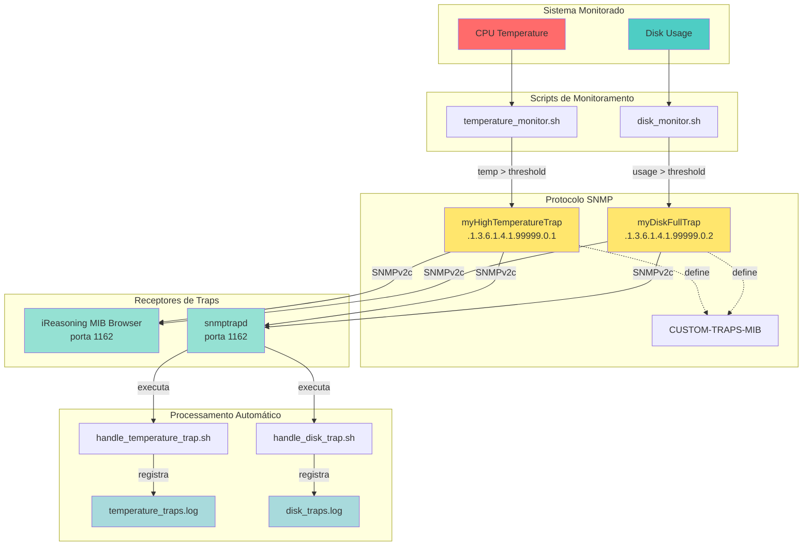
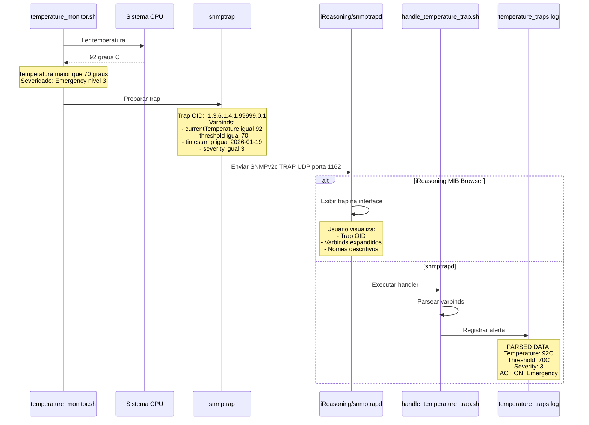

# Tarefa 03: SNMP Traps - Notificações de Temperatura e Disco

## Descrição

Sistema de monitoramento com envio de **SNMP Traps** para notificar eventos críticos de temperatura e uso de disco. Demonstração prática de traps SNMP v2c usando iReasoning MIB Browser como receptor.

## Objetivos

- Criar MIB customizada (CUSTOM-TRAPS-MIB) com definição de traps
- Implementar scripts de monitoramento de temperatura e disco  
- Testar envio e recepção de traps com iReasoning MIB Browser
- Demonstrar processamento automático com handlers

## Arquitetura do Sistema



## Fluxo de Envio de Trap



## Estrutura de Arquivos

```
Tarefa03_Traps/
├── CUSTOM-TRAPS-MIB.txt          # MIB com definições dos traps
├── README.md                      # Esta documentação
├── snmptrapd.conf.example         # Configuração do snmptrapd
├── temperature_monitor.sh         # Monitor de temperatura
├── disk_monitor.sh                # Monitor de uso de disco
└── scripts/
    ├── handle_temperature_trap.sh # Handler para processar traps de temperatura
    └── handle_disk_trap.sh        # Handler para processar traps de disco
```

## Traps Implementados

### 1. myHighTemperatureTrap
**OID:** `.1.3.6.1.4.1.99999.0.1`

Enviado quando a temperatura ultrapassa o limite configurado.

**Varbinds:**
- `currentTemperature` (.3.1.1.0): Temperatura atual (°C)
- `temperatureThreshold` (.3.1.2.0): Limite configurado (°C)
- `alertTimestamp` (.3.1.7.0): Data/hora do alerta
- `alertSeverity` (.3.1.8.0): Severidade (1=warning, 2=critical, 3=emergency)

### 2. myDiskFullTrap
**OID:** `.1.3.6.1.4.1.99999.0.2`

Enviado quando uma partição atinge capacidade crítica.

**Varbinds:**
- `diskPartition` (.3.1.3.0): Nome da partição
- `diskUsagePercent` (.3.1.4.0): Percentual de uso
- `diskTotalMB` (.3.1.5.0): Espaço total (MB)
- `diskUsedMB` (.3.1.6.0): Espaço usado (MB)
- `alertTimestamp` (.3.1.7.0): Data/hora do alerta
- `alertSeverity` (.3.1.8.0): Severidade

## Demonstração com iReasoning MIB Browser

### Passo 1: Preparar o Ambiente

```bash
# 1. Copiar a MIB para o diretório do iReasoning
cp CUSTOM-TRAPS-MIB.txt ~/Downloads/ireasoning/mibbrowser/mibs/

# 2. Dar permissão de execução aos scripts
chmod +x temperature_monitor.sh disk_monitor.sh
```

### Passo 2: Iniciar o iReasoning MIB Browser

```bash
# Iniciar como usuário normal (porta > 1024 não requer sudo)
cd ~/Downloads/ireasoning/mibbrowser
./browser.sh
```

### Passo 3: Carregar a MIB no iReasoning

1. Menu: **File → Load MIBs**
2. Selecione: `CUSTOM-TRAPS-MIB.txt`
3. Clique: **Open**
4. Aguarde: A MIB será carregada e validada

### Passo 4: Configurar o Trap Receiver

1. Menu: **Operation → Trap Receiver**
2. Configure:
   - **TRAP PORTS:** `1162` (porta onde o iReasoning vai escutar)
   - **Community:** `public`
   - **Version:** `v2c`
3. Clique: **Start**
4. Aguarde mensagem: "Trap receiver started on port 1162"

### Passo 5: Enviar Traps de Teste

#### Trap de Temperatura (92°C, Emergency)

```bash
snmptrap -v 2c -c public localhost:1162 '' .1.3.6.1.4.1.99999.0.1 \
    .1.3.6.1.4.1.99999.3.1.1.0 i 92 \
    .1.3.6.1.4.1.99999.3.1.2.0 i 70 \
    .1.3.6.1.4.1.99999.3.1.7.0 s "2026-01-19 15:15:00" \
    .1.3.6.1.4.1.99999.3.1.8.0 i 3
```

#### Trap de Disco (97%, Emergency)

```bash
snmptrap -v 2c -c public localhost:1162 '' .1.3.6.1.4.1.99999.0.2 \
    .1.3.6.1.4.1.99999.3.1.3.0 s "/dev/sda1" \
    .1.3.6.1.4.1.99999.3.1.4.0 i 97 \
    .1.3.6.1.4.1.99999.3.1.5.0 i 500000 \
    .1.3.6.1.4.1.99999.3.1.6.0 i 485000 \
    .1.3.6.1.4.1.99999.3.1.7.0 s "2026-01-19 15:15:30" \
    .1.3.6.1.4.1.99999.3.1.8.0 i 3
```

### Passo 6: Visualizar os Traps no iReasoning

**O que você deve ver:**

1. **Lista de Traps:** Cada trap aparece como uma linha no Trap Receiver
2. **Informações visíveis:**
   - Source: `127.0.0.1`
   - Community: `public`
   - Trap OID: `.1.3.6.1.4.1.99999.0.1` (temperatura) ou `.0.2` (disco)
3. **Expandir o trap:** Clique no `+` ou dê duplo clique para ver os varbinds
4. **Varbinds com nomes descritivos:**
   - `currentTemperature = 92`
   - `temperatureThreshold = 70`
   - `alertTimestamp = "2026-01-19 15:15:00"`
   - `alertSeverity = 3`

### Passo 7: Testar com Scripts Reais

#### Monitor de Temperatura

```bash
# Executar com threshold baixo (30°C) para forçar disparo
./temperature_monitor.sh 30 localhost:1162 60
```

**No prompt do script:**
- Digite `s` para enviar trap de teste
- Digite `N` para não iniciar monitoramento contínuo

#### Monitor de Disco

```bash
# Executar com threshold baixo (5%) para forçar disparo
./disk_monitor.sh 5 localhost:1162 300
```

**No prompt do script:**
- Digite `s` para enviar trap de teste da primeira partição
- Digite `N` para não iniciar monitoramento contínuo

## Resultados Esperados

### Trap de Temperatura no iReasoning

```
Trap OID: .1.3.6.1.4.1.99999.0.1 (myHighTemperatureTrap)
Source: 127.0.0.1
Community: public

Varbinds:
  [1] currentTemperature = 20 (INTEGER)
  [2] temperatureThreshold = 30 (INTEGER)
  [3] alertTimestamp = "2026-01-19T15:15:00-03:00" (STRING)
  [4] alertSeverity = 2 (INTEGER)
```

### Trap de Disco no iReasoning

```
Trap OID: .1.3.6.1.4.1.99999.0.2 (myDiskFullTrap)
Source: 127.0.0.1
Community: public

Varbinds:
  [1] diskPartition = "/" (STRING)
  [2] diskUsagePercent = 34 (INTEGER)
  [3] diskTotalMB = 478563 (INTEGER)
  [4] diskUsedMB = 152642 (INTEGER)
  [5] alertTimestamp = "2026-01-19T15:15:30-03:00" (STRING)
  [6] alertSeverity = 2 (INTEGER)
```

## Processamento Automático com snmptrapd

Para demonstrar processamento automático dos traps (não requer iReasoning):

### 1. Configurar snmptrapd

```bash
# Copiar configuração
sudo cp snmptrapd.conf.example /etc/snmp/snmptrapd.conf

# Instalar handlers
sudo cp scripts/handle_*.sh /usr/local/bin/
sudo chmod +x /usr/local/bin/handle_*.sh
```

### 2. Iniciar snmptrapd

```bash
# Porta alternativa (systemd ocupa 162)
sudo snmptrapd -f -Lo -c /etc/snmp/snmptrapd.conf udp:1162
```

### 3. Enviar Traps

Use os mesmos comandos do Passo 5 (porta 1162).

### 4. Verificar Logs Gerados

```bash
# Log de temperatura
tail -f /var/log/temperature_traps.log

# Log de disco
tail -f /var/log/disk_traps.log
```

**Exemplo de log processado:**

```
========================================
[2026-01-19 15:15:00] HIGH TEMPERATURE TRAP RECEIVED
========================================
PARSED DATA:
  Current Temperature: 92°C
  Threshold: 70°C
  Alert Time: 2026-01-19 15:15:00
  Severity: 3 (1=warning, 2=critical, 3=emergency)
----------------------------------------
ACTION: Emergency level - Immediate action required!
[2026-01-19 15:15:00] Trap processed successfully
```

## Detalhes Técnicos

### Níveis de Severidade

- **1 - Warning:** Situação anormal mas não crítica
- **2 - Critical:** Requer atenção imediata
- **3 - Emergency:** Situação crítica, ação urgente necessária

### Lógica dos Scripts

**temperature_monitor.sh:**
- Detecta temperatura via: sensors, /sys/class/thermal/, vcgencmd (RPi), osx-cpu-temp (MacOS)
- Fallback: Simula temperatura para testes
- Severidade: Critical (> threshold), Emergency (> threshold + 20°C)

**disk_monitor.sh:**
- Monitora todas as partições reais (exclui tmpfs, devtmpfs)
- Calcula percentual e valores em MB
- Severidade: Critical (> threshold), Emergency (> threshold + 5%)

### Formato dos OIDs

**Base:** `.1.3.6.1.4.1.99999.3` (enterprises.99999.3)

**Traps:**
- `.1.3.6.1.4.1.99999.0.1` - myHighTemperatureTrap
- `.1.3.6.1.4.1.99999.0.2` - myDiskFullTrap

**Objetos:** `.1.3.6.1.4.1.99999.3.1.X.0`
- .1.0 = currentTemperature
- .2.0 = temperatureThreshold
- .3.0 = diskPartition
- .4.0 = diskUsagePercent
- .5.0 = diskTotalMB
- .6.0 = diskUsedMB
- .7.0 = alertTimestamp
- .8.0 = alertSeverity

## 🔍 Troubleshooting

### Porta 162 ocupada pelo systemd

**Sintoma:** `Address already in use` ao iniciar trap receiver

**Solução:** Use porta alternativa 1162 (não requer privilégios)
```bash
# No iReasoning: TRAP PORTS = 1162
# Nos comandos: localhost:1162
```

### MIB não carrega no iReasoning

**Solução:** Verifique se o arquivo está no diretório correto
```bash
ls -l ~/Downloads/ireasoning/mibbrowser/mibs/CUSTOM-TRAPS-MIB.txt
```

### Traps não aparecem no iReasoning

1. **Verificar se o Trap Receiver está rodando** (status deve ser "Started")
2. **Verificar a porta:** Deve ser 1162 em TRAP PORTS
3. **Testar conectividade:**
   ```bash
   # Enviar trap simples
   snmptrap -v 2c -c public localhost:1162 '' .1.3.6.1.4.1.99999.0.1
   ```

### Scripts não detectam temperatura

**Solução:** Instale lm-sensors
```bash
sudo apt-get install lm-sensors
sudo sensors-detect  # Responda YES para todas as perguntas
sensors  # Testar
```

**Alternativa:** Use threshold muito baixo para forçar alerta com temperatura simulada
```bash
./temperature_monitor.sh 10 localhost:1162
```

## Referências

- RFC 3416 - SNMPv2 Protocol Operations (Notifications)
- RFC 3584 - Coexistence between SNMP versions
- man snmptrap(1)
- man snmptrapd(8)
- iReasoning MIB Browser Documentation

## Autores

- ANTONIA MAYARA DE ALMEIDA DA SILVA (mayaraalmeida@alu.ufc.br)
- JOÃO BATISTA ANDRADE DOS SANTOS (batistajoaoguns@alu.ufc.br)
- Marcos Dantas Ortiz (mdo@ufc.br)

**Disciplina:** Gerência de Redes  - MDCC
**Instituição:** UFC - Universidade Federal do Ceará  