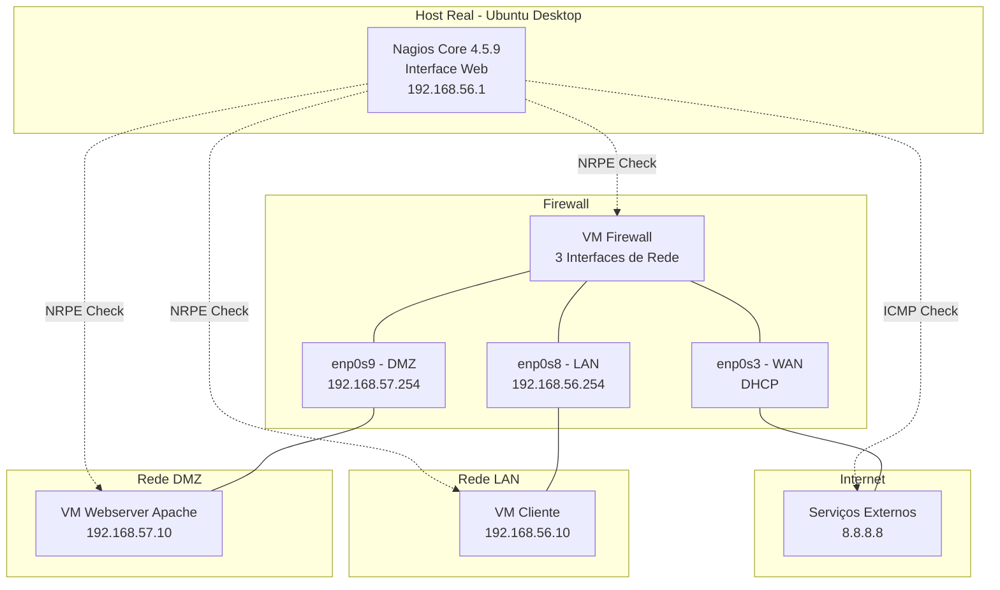
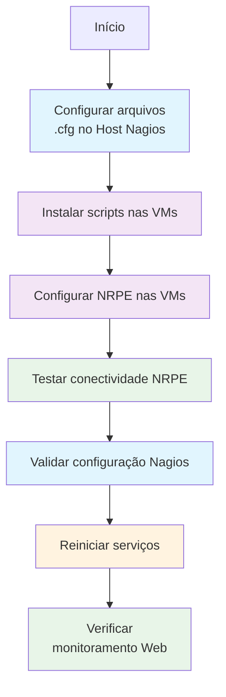
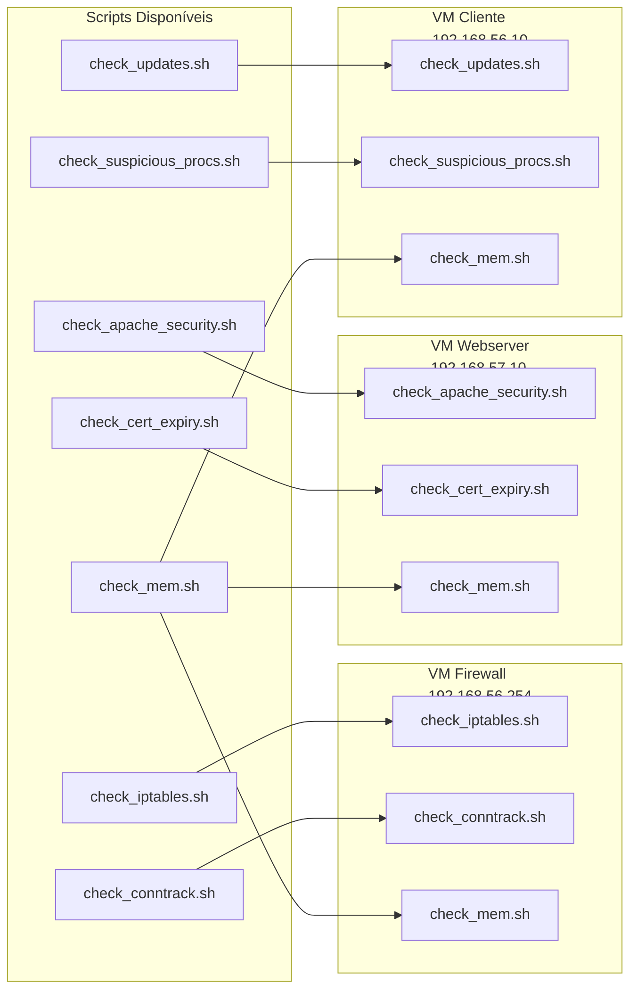
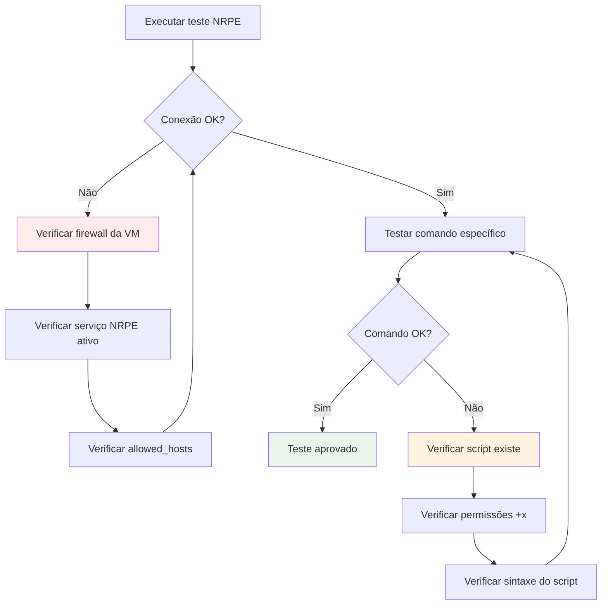
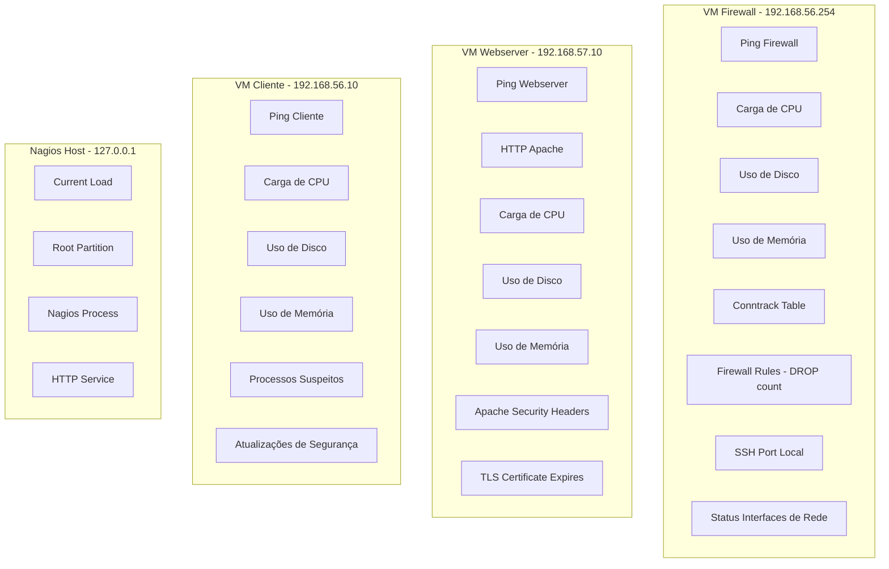

# Laboratório de Segurança — Fase 2 (Avançado)
**Nagios Core 4.5.9 — implementação com checagens de segurança realistas**

## Visão Geral da Arquitetura



## Estrutura de Arquivos Entregues

### Diretório servers/ - Configurações do Nagios
Destino: `/usr/local/nagios/etc/servers/` (HOST REAL - Nagios)
- `firewall.cfg` — Configuração de monitoramento do firewall
- `webserver.cfg` — Configuração de monitoramento do servidor web
- `cliente.cfg` — Configuração de monitoramento do cliente
- `localhost.cfg` — Configuração de monitoramento do próprio Nagios

### Diretório scripts/ - Plugins Customizados
Destino: `/usr/lib/nagios/plugins/` (VMs correspondentes)
- `check_iptables.sh` — Monitora eventos de bloqueio do firewall
- `check_apache_security.sh` — Verifica headers de segurança HTTP
- `check_updates.sh` — Detecta atualizações de segurança pendentes
- `check_conntrack.sh` — Monitora tabela de conexões ativas
- `check_suspicious_procs.sh` — Detecta processos suspeitos

## Fluxo de Implementação



## Instruções Detalhadas de Implementação

### Etapa 1: Configuração no Host Real (Nagios Server)
**Local de execução: Host Real - Ubuntu Desktop com Nagios instalado**

1. Copie os arquivos de configuração:
```bash
sudo cp servers/*.cfg /usr/local/nagios/etc/servers/
```

### Etapa 2: Instalação dos Scripts nas VMs
**Local de execução: Cada VM (Firewall, Webserver, Cliente)**

2. Copie os scripts relevantes para cada VM:
```bash
sudo cp scripts/*.sh /usr/lib/nagios/plugins/
sudo chmod +x /usr/lib/nagios/plugins/check_*.sh
```

### Etapa 3: Configuração do NRPE nas VMs
**Local de execução: Cada VM individualmente**

3. Configure o arquivo NRPE conforme a função de cada VM:
```bash
sudo nano /etc/nagios/nrpe.cfg
# Adicionar comandos específicos (ver seções detalhadas por VM abaixo)
```

4. Reinicie o serviço NRPE em cada VM:
```bash
sudo systemctl restart nagios-nrpe-server
sudo systemctl status nagios-nrpe-server
```

5. Teste a conectividade a partir do host Nagios:
```bash
# Executar no Host Real - Nagios Server
/usr/local/nagios/libexec/check_nrpe -H [IP_DA_VM] -c check_load
```

### Etapa 4: Validação e Ativação
**Local de execução: Host Real - Nagios Server**

6. Valide a configuração do Nagios:
```bash
sudo /usr/local/nagios/bin/nagios -v /usr/local/nagios/etc/nagios.cfg
```

7. Reinicie o serviço Nagios:
```bash
sudo systemctl restart nagios
sudo systemctl status nagios
```

8. Acesse a interface web para verificar o monitoramento:
```bash
# Abrir navegador no endereço:
# http://localhost/nagios
# Usuário: nagiosadmin
# Senha: (definida durante a instalação)
```

---

## servers/firewall.cfg
```cfg
define host {
  use linux-server
  host_name Firewall
  alias Firewall Ubuntu Server
  address 192.168.56.254
}
define service {
  use generic-service
  host_name Firewall
  service_description Ping Firewall
  check_command check_ping!100.0,20%!500.0,60%
}
define service {
  use generic-service
  host_name Firewall
  service_description Carga de CPU
  check_command check_nrpe!check_load
}
define service {
  use generic-service
  host_name Firewall
  service_description Uso de Disco
  check_command check_nrpe!check_disk
}
define service {
  use generic-service
  host_name Firewall
  service_description Uso de Memória
  check_command check_nrpe!check_mem
}
define service {
  use generic-service
  host_name Firewall
  service_description Conntrack Table
  check_command check_nrpe!check_conntrack
}
define service {
  use generic-service
  host_name Firewall
  service_description Firewall Rules (DROP count)
  check_command check_nrpe!check_iptables
}
define service {
  use generic-service
  host_name Firewall
  service_description SSH Port Local
  check_command check_nrpe!check_ssh_local
}
define service {
  use generic-service
  host_name Firewall
  service_description Status de Interfaces de Rede
  check_command check_nrpe!check_ifstatus
}
```

---

## servers/webserver.cfg
```cfg
define host {
  use linux-server
  host_name Webserver
  alias Webserver Apache
  address 192.168.57.10
}

define service {
  use generic-service
  host_name Webserver
  service_description Ping Webserver
  check_command check_ping!100.0,20%!500.0,60%
}
define service {
  use generic-service
  host_name Webserver
  service_description HTTP Apache
  check_command check_http
}
define service {
  use generic-service
  host_name Webserver
  service_description Carga de CPU
  check_command check_nrpe!check_load
}
define service {
  use generic-service
  host_name Webserver
  service_description Uso de Disco
  check_command check_nrpe!check_disk
}
define service {
  use generic-service
  host_name Webserver
  service_description Uso de Memória
  check_command check_nrpe!check_mem
}
define service {
  use generic-service
  host_name Webserver
  service_description Apache Security Headers
  check_command check_nrpe!check_apache_security
}
define service {
  use generic-service
  host_name Webserver
  service_description TLS Certificate Expires
  check_command check_nrpe!check_cert_expiry
}
```

---

## servers/cliente.cfg
```cfg
define host {
  use linux-server
  host_name Cliente
  alias Cliente Interno
  address 192.168.56.10
}

define service {
  use generic-service
  host_name Cliente
  service_description Ping Cliente
  check_command check_ping!100.0,20%!500.0,60%
}
define service {
  use generic-service
  host_name Cliente
  service_description Carga de CPU
  check_command check_nrpe!check_load
}
define service {
  use generic-service
  host_name Cliente
  service_description Uso de Disco
  check_command check_nrpe!check_disk
}
define service {
  use generic-service
  host_name Cliente
  service_description Uso de Memória
  check_command check_nrpe!check_mem
}
define service {
  use generic-service
  host_name Cliente
  service_description Processos Suspeitos
  check_command check_nrpe!check_suspicious_procs
}
define service {
  use generic-service
  host_name Cliente
  service_description Atualizações de Segurança
  check_command check_nrpe!check_updates
}
```

---

## servers/localhost.cfg
```cfg
define host {
  use linux-server
  host_name localhost
  alias Nagios Host
  address 127.0.0.1
}
define service {
  use generic-service
  host_name localhost
  service_description Current Load
  check_command check_local_load
}
define service {
  use generic-service
  host_name localhost
  service_description Root Partition
  check_command check_local_disk
}
define service {
  use generic-service
  host_name localhost
  service_description Nagios Process
  check_command check_local_nagios
}
define service {
  use generic-service
  host_name localhost
  service_description HTTP
  check_command check_http
}
```

---

## Referência Rápida de Comandos NRPE

### Comandos Básicos para Todas as VMs
```cfg
# Recursos básicos do sistema
command[check_disk]=/usr/lib/nagios/plugins/check_disk -w 20% -c 10% -p /
command[check_load]=/usr/lib/nagios/plugins/check_load -w 5,4,3 -c 10,6,4
command[check_mem]=/usr/lib/nagios/plugins/check_mem.sh -w 80 -c 90

# Conectividade local
command[check_ssh_local]=/usr/lib/nagios/plugins/check_ssh localhost
```

### Comandos Específicos por Funcionalidade
```cfg
# Firewall - Segurança e rede
command[check_conntrack]=/usr/lib/nagios/plugins/check_conntrack.sh
command[check_iptables]=/usr/lib/nagios/plugins/check_iptables.sh
command[check_ifstatus]=/usr/lib/nagios/plugins/check_ifstatus

# Webserver - Segurança web
command[check_apache_security]=/usr/lib/nagios/plugins/check_apache_security.sh
command[check_cert_expiry]=/usr/lib/nagios/plugins/check_cert_expiry.sh

# Cliente - Segurança do endpoint
command[check_updates]=/usr/lib/nagios/plugins/check_updates.sh
command[check_suspicious_procs]=/usr/lib/nagios/plugins/check_suspicious_procs.sh
```

---

## scripts/check_iptables.sh
```bash
#!/bin/bash
MINUTES=5
WARN=10
CRIT=50
COUNT=$(journalctl --since="${MINUTES} minutes ago" -k | grep -E "IN=.*(DROP|REJECT)" | wc -l 2>/dev/null || true)
if [ -z "$COUNT" ]; then COUNT=0; fi
if [ "$COUNT" -ge "$CRIT" ]; then
  echo "FIREWALL CRITICAL - $COUNT DROP/REJECT events in last ${MINUTES}m"
  exit 2
elif [ "$COUNT" -ge "$WARN" ]; then
  echo "FIREWALL WARNING - $COUNT DROP/REJECT events in last ${MINUTES}m"
  exit 1
else
  echo "FIREWALL OK - $COUNT DROP/REJECT events in last ${MINUTES}m"
  exit 0
fi
```

---

## scripts/check_apache_security.sh
```bash
#!/bin/bash
URL="${1:-http://localhost/}"
TMP=$(mktemp)
curl -s -D "$TMP" "$URL" -o /dev/null
H1=$(grep -i "^X-Frame-Options:" "$TMP" || true)
H2=$(grep -i "^Content-Security-Policy:" "$TMP" || true)
H3=$(grep -i "^X-Content-Type-Options:" "$TMP" || true)
H4=$(grep -i "^Strict-Transport-Security:" "$TMP" || true)
rm -f "$TMP"
MISSING=0
[ -z "$H1" ] && MISSING=$((MISSING+1))
[ -z "$H2" ] && MISSING=$((MISSING+1))
[ -z "$H3" ] && MISSING=$((MISSING+1))
if [ -n "$H4" ]; then :
fi
if [ "$MISSING" -eq 0 ]; then
  echo "APACHE OK - security headers present"
  exit 0
elif [ "$MISSING" -le 2 ]; then
  echo "APACHE WARNING - $MISSING security headers missing"
  exit 1
else
  echo "APACHE CRITICAL - $MISSING security headers missing"
  exit 2
fi
```

---

## scripts/check_updates.sh
```bash
#!/bin/bash
sudo apt update -qq >/dev/null 2>&1
PKG_COUNT=$(apt list --upgradable 2>/dev/null | grep -v "Listing..." | wc -l || true)
CRIT=10
WARN=2
if [ "$PKG_COUNT" -ge "$CRIT" ]; then
  echo "UPDATES CRITICAL - $PKG_COUNT packages upgradable"
  exit 2
elif [ "$PKG_COUNT" -ge "$WARN" ]; then
  echo "UPDATES WARNING - $PKG_COUNT packages upgradable"
  exit 1
else
  echo "UPDATES OK - $PKG_COUNT packages upgradable"
  exit 0
fi
```

---

## scripts/check_conntrack.sh
```bash
#!/bin/bash
WARN=1000
CRIT=2000
if command -v conntrack >/dev/null 2>&1; then
  CNT=$(conntrack -C 2>/dev/null || ss -s 2>/dev/null | grep 'connections' -m1 | awk '{print $1}' || true)
else
  CNT=$(cat /proc/sys/net/netfilter/nf_conntrack_count 2>/dev/null || echo 0)
fi
CNT=${CNT:-0}
if [ "$CNT" -ge "$CRIT" ]; then
  echo "CONNTRACK CRITICAL - $CNT entries"
  exit 2
elif [ "$CNT" -ge "$WARN" ]; then
  echo "CONNTRACK WARNING - $CNT entries"
  exit 1
else
  echo "CONNTRACK OK - $CNT entries"
  exit 0
fi
```

---

## scripts/check_suspicious_procs.sh (exemplo)
```bash
#!/bin/bash
# busca processos com nomes típicos de ferramentas de ataque
PATTERN="nmap|nc|netcat|socat|metasploit|msfconsole|python -m http.server"
FOUND=$(ps aux | egrep -i "$PATTERN" | egrep -v "egrep|check_suspicious_procs" || true)
if [ -n "$FOUND" ]; then
  echo "SUSPICIOUS_PROCS CRITICAL - found suspicious processes"
  echo "$FOUND"
  exit 2
else
  echo "SUSPICIOUS_PROCS OK - no suspicious processes found"
  exit 0
fi
```

---

## Observações
- Ajuste thresholds (WARN/CRIT) conforme sua turma e capacidade das VMs.
- Certifique-se de rodar `chmod +x` nos scripts e testar manualmente cada script antes de habilitar no NRPE.


## Configuração Detalhada por VM

### Distribuição de Scripts por VM



### Preparação das VMs - Instalação de Dependências

**Executar em TODAS as VMs (Firewall, Webserver, Cliente):**

```bash
# Atualizar repositórios
sudo apt update

# Instalar dependências necessárias
sudo apt install -y curl conntrack nagios-nrpe-server monitoring-plugins-basic

# Verificar se o serviço NRPE está ativo
sudo systemctl enable nagios-nrpe-server
sudo systemctl start nagios-nrpe-server
```

### Configuração Específica por VM

#### VM Firewall (192.168.56.254) - Configuração NRPE

**Local de execução: VM Firewall**

1. Copiar scripts necessários:
```bash
sudo cp scripts/check_iptables.sh /usr/lib/nagios/plugins/
sudo cp scripts/check_conntrack.sh /usr/lib/nagios/plugins/
sudo cp scripts/check_mem.sh /usr/lib/nagios/plugins/
sudo chmod +x /usr/lib/nagios/plugins/check_*.sh
```

2. Editar arquivo NRPE:
```bash
sudo nano /etc/nagios/nrpe.cfg
```

3. Adicionar as seguintes linhas ao final do arquivo:
```cfg
# Configuração para VM Firewall
allowed_hosts=127.0.0.1,192.168.56.1
dont_blame_nrpe=1

# Comandos básicos de sistema
command[check_disk]=/usr/lib/nagios/plugins/check_disk -w 20% -c 10% -p /
command[check_load]=/usr/lib/nagios/plugins/check_load -w 5,4,3 -c 10,6,4
command[check_mem]=/usr/lib/nagios/plugins/check_mem.sh

# Comandos específicos do firewall
command[check_conntrack]=/usr/lib/nagios/plugins/check_conntrack.sh
command[check_iptables]=/usr/lib/nagios/plugins/check_iptables.sh
command[check_ssh_local]=/usr/lib/nagios/plugins/check_ssh localhost
command[check_ifstatus]=/usr/lib/nagios/plugins/check_ifstatus
```

4. Reiniciar o serviço:
```bash
sudo systemctl restart nagios-nrpe-server
```

#### VM Webserver (192.168.57.10) - Configuração NRPE

**Local de execução: VM Webserver**

1. Copiar scripts necessários:
```bash
sudo cp scripts/check_apache_security.sh /usr/lib/nagios/plugins/
sudo cp scripts/check_cert_expiry.sh /usr/lib/nagios/plugins/
sudo cp scripts/check_mem.sh /usr/lib/nagios/plugins/
sudo chmod +x /usr/lib/nagios/plugins/check_*.sh
```

2. Editar arquivo NRPE:
```bash
sudo nano /etc/nagios/nrpe.cfg
```

3. Adicionar as seguintes linhas ao final do arquivo:
```cfg
# Configuração para VM Webserver
allowed_hosts=127.0.0.1,192.168.56.1
dont_blame_nrpe=1

# Comandos básicos de sistema
command[check_disk]=/usr/lib/nagios/plugins/check_disk -w 20% -c 10% -p /
command[check_load]=/usr/lib/nagios/plugins/check_load -w 5,4,3 -c 10,6,4
command[check_mem]=/usr/lib/nagios/plugins/check_mem.sh

# Comandos específicos do webserver
command[check_apache_security]=/usr/lib/nagios/plugins/check_apache_security.sh
command[check_cert_expiry]=/usr/lib/nagios/plugins/check_cert_expiry.sh
```

4. Reiniciar o serviço:
```bash
sudo systemctl restart nagios-nrpe-server
```

#### VM Cliente (192.168.56.10) - Configuração NRPE

**Local de execução: VM Cliente**

1. Copiar scripts necessários:
```bash
sudo cp scripts/check_updates.sh /usr/lib/nagios/plugins/
sudo cp scripts/check_suspicious_procs.sh /usr/lib/nagios/plugins/
sudo cp scripts/check_mem.sh /usr/lib/nagios/plugins/
sudo chmod +x /usr/lib/nagios/plugins/check_*.sh
```

2. Editar arquivo NRPE:
```bash
sudo nano /etc/nagios/nrpe.cfg
```

3. Adicionar as seguintes linhas ao final do arquivo:
```cfg
# Configuração para VM Cliente
allowed_hosts=127.0.0.1,192.168.56.1
dont_blame_nrpe=1

# Comandos básicos de sistema
command[check_disk]=/usr/lib/nagios/plugins/check_disk -w 20% -c 10% -p /
command[check_load]=/usr/lib/nagios/plugins/check_load -w 5,4,3 -c 10,6,4
command[check_mem]=/usr/lib/nagios/plugins/check_mem.sh

# Comandos específicos do cliente
command[check_updates]=/usr/lib/nagios/plugins/check_updates.sh
command[check_suspicious_procs]=/usr/lib/nagios/plugins/check_suspicious_procs.sh
```

4. Reiniciar o serviço:
```bash
sudo systemctl restart nagios-nrpe-server
```


## Teste de Conectividade e Validação

### Teste NRPE - Host Real para VMs

**Local de execução: Host Real - Nagios Server**

Teste a conectividade NRPE para cada VM:

```bash
# Teste VM Firewall
/usr/local/nagios/libexec/check_nrpe -H 192.168.56.254 -c check_load

# Teste VM Webserver  
/usr/local/nagios/libexec/check_nrpe -H 192.168.57.10 -c check_load

# Teste VM Cliente
/usr/local/nagios/libexec/check_nrpe -H 192.168.56.10 -c check_load
```

### Fluxo de Teste e Resolução de Problemas



### Validação Final do Nagios

**Local de execução: Host Real - Nagios Server**

1. Validar configuração do Nagios:
```bash
sudo /usr/local/nagios/bin/nagios -v /usr/local/nagios/etc/nagios.cfg
```

2. Se a validação for bem-sucedida, reiniciar o Nagios:
```bash
sudo systemctl restart nagios
sudo systemctl status nagios
```

3. Acessar interface web:
```
http://localhost/nagios
```
Usuário: nagiosadmin
Senha: (definida na instalação)

## Monitoramento Implementado por Host

### Resumo dos Serviços Monitorados



## Observações Importantes

### Ajustes de Thresholds
Os valores de alerta (WARNING/CRITICAL) podem ser ajustados conforme o ambiente:
- **check_iptables.sh**: WARN=10, CRIT=50 (eventos de bloqueio)
- **check_conntrack.sh**: WARN=1000, CRIT=2000 (conexões ativas)
- **check_updates.sh**: WARN=2, CRIT=10 (pacotes pendentes)
- **check_mem.sh**: WARN=80%, CRIT=90% (uso de memória)

### Troubleshooting Comum
1. **Erro de conexão NRPE**: Verificar allowed_hosts e firewall
2. **Script não encontrado**: Verificar caminho e permissões
3. **Timeout**: Ajustar timeout no nagios.cfg ou nrpe.cfg
4. **Permissões sudo**: Alguns scripts podem precisar de sudoers específico

### Próximos Passos Sugeridos
1. Implementar notificações por email
2. Configurar retenção de dados históricos
3. Integrar com Grafana para visualizações avançadas
4. Implementar backup automático das configurações
5. Criar playbooks Ansible para automação da implantação
