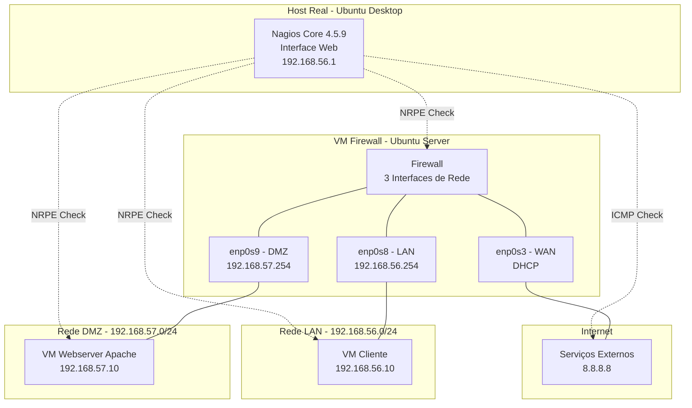
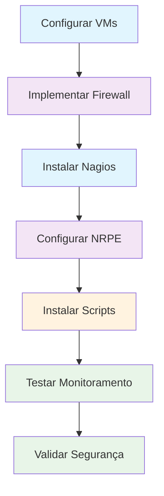
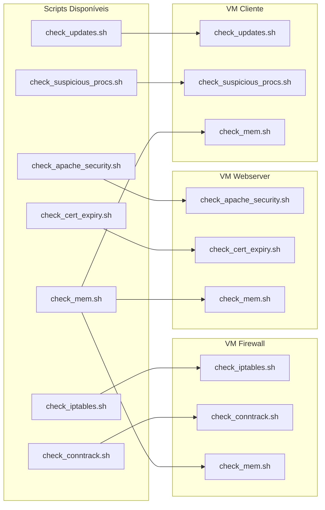

# Laboratório de Segurança e Gerência de Redes

Este projeto implementa um ambiente de laboratório para ensino de **Segurança Cibernética** e **Gerência de Redes**, utilizando virtualização, firewall e monitoramento centralizado com Nagios Core.

## Objetivo

Criar um ambiente educacional realista que aborda desde infraestrutura básica até monitoramento avançado com detecção de ameaças, usando ferramentas e scripts customizados de segurança.

## Arquitetura do Sistema

## Estrutura do Projeto

### Fase 1: Infraestrutura e Firewall
- **Ambiente virtualizado** com 3 redes segregadas (LAN, DMZ, Internet)
- **Firewall Ubuntu Server** com NAT, DNAT e roteamento estateful
- **Política de segurança DROP** por padrão com acesso SSH permitido
- **Documentação**: `Fase1_Lab_de-Seguranca.md`

### Fase 2: Monitoramento Básico
- **Nagios Core 4.5.9** para monitoramento centralizado
- **NRPE** (Nagios Remote Plugin Executor) para execução remota
- **Monitoramento básico** de recursos e disponibilidade
- **Documentação**: `Fase2_Lab_Gerencia_Nagios.md`

### Fase 2 Avançado: Monitoramento de Segurança
- **Scripts customizados** de detecção de ameaças
- **Monitoramento proativo** de eventos de segurança
- **Alertas especializados** para ambiente de produção
- **Documentação**: `Lab_Seguranca_Fase2_Avancado.md`

## Fluxo de Implementação

## Componentes do Sistema

### Scripts de Monitoramento (`scripts/`)

| Script | Funcionalidade | Local de Instalação |
|--------|---------------|-------------------|
| `check_iptables.sh` | Monitora eventos DROP/REJECT do firewall | VM Firewall |
| `check_apache_security.sh` | Verifica headers de segurança HTTP | VM Webserver |
| `check_conntrack.sh` | Monitora tabela de conexões ativas | VM Firewall |
| `check_updates.sh` | Detecta atualizações de segurança pendentes | VM Cliente |
| `check_suspicious_procs.sh` | Detecta processos suspeitos | VM Cliente |
| `check_mem.sh` | Monitoramento avançado de uso de memória | Todas as VMs |
| `check_cert_expiry.sh` | Verifica expiração de certificados TLS | VM Webserver |

### Configurações Nagios (`servers/`)

| Arquivo | Descrição | Serviços Monitorados |
|---------|-----------|---------------------|
| `firewall.cfg` | Configuração do firewall | 8 serviços (ping, CPU, disco, memória, conntrack, iptables, SSH, interfaces) |
| `webserver.cfg` | Configuração do webserver | 7 serviços (ping, HTTP, recursos + segurança Apache) |
| `cliente.cfg` | Configuração do cliente | 6 serviços (recursos + detecção de ameaças) |
| `localhost.cfg` | Configuração do Nagios | 4 serviços (recursos locais do Nagios) |

### Outros Arquivos

- `firewall.sh` - Script principal de configuração do firewall com iptables
- `index.html` - Página web de status e documentação do laboratório

## Distribuição de Scripts por VM

## Tecnologias Utilizadas

### Infraestrutura
- **Virtualização**: VMware Workstation / VirtualBox
- **Sistema Operacional**: Ubuntu Server 24.04 LTS / Ubuntu Desktop 24.04
- **Rede**: Configuração multi-homed com 3 interfaces

### Segurança
- **Firewall**: iptables com scripting bash avançado
- **Política**: DROP por padrão, permitir apenas tráfego necessário
- **Monitoramento**: Detecção proativa de eventos de segurança

### Monitoramento
- **Nagios Core**: Versão 4.5.9 para monitoramento empresarial
- **NRPE**: Execução remota de plugins de monitoramento
- **Plugins**: Scripts customizados em bash para detecção de ameaças

## Valor Educacional

### Conceitos de Segurança Abordados
- **Segmentação de rede** e arquitetura DMZ
- **Firewall estateful** com controle granular de tráfego
- **Monitoramento proativo** de eventos de segurança
- **Detecção de intrusão** comportamental
- **Análise de logs** e resposta a incidentes
- **Hardening** de serviços web com headers de segurança

### Conceitos de Redes Abordados
- **Roteamento** entre redes com múltiplas interfaces
- **NAT e DNAT** para tradução de endereços
- **Controle de tráfego** com iptables
- **Monitoramento de conectividade** e performance

### Habilidades Técnicas Desenvolvidas
- **Administração de sistemas Linux** avançada
- **Configuração de firewalls** enterprise
- **Implementação de sistemas de monitoramento** centralizados
- **Desenvolvimento de scripts** de automação e segurança
- **Troubleshooting** de conectividade e serviços
- **Análise de performance** e otimização de sistemas

## Como Usar Este Projeto

### Pré-requisitos
- VMware Workstation ou VirtualBox
- Ubuntu Desktop 24.04 (host real)
- Pelo menos 8GB RAM e 100GB de espaço em disco
- Conhecimentos básicos de Linux e redes

### Implementação
1. **Fase 1**: Configure as VMs seguindo `Fase1_Lab_de-Seguranca.md`
2. **Fase 2**: Instale o Nagios conforme `Fase2_Lab_Gerencia_Nagios.md`
3. **Fase 2 Avançado**: Implemente monitoramento de segurança usando `Lab_Seguranca_Fase2_Avancado.md`

### Estrutura de Testes
- **Teste de conectividade**: Ping entre todas as redes
- **Teste de NAT**: Acesso à Internet a partir da LAN e DMZ
- **Teste de DNAT**: Acesso ao webserver a partir da Internet
- **Teste de monitoramento**: Verificação de todos os serviços Nagios
- **Teste de segurança**: Simulação de ataques e detecção

## Documentação

Cada fase possui documentação detalhada incluindo:
- **Diagramas Mermaid** da arquitetura e fluxos
- **Comandos passo-a-passo** com explicações
- **Instruções de troubleshooting** para problemas comuns
- **Exemplos práticos** de uso e configuração
- **Referências de comandos** NRPE e configurações

## Troubleshooting Comum

### Problemas de Conectividade
- Verificar configuração de rede das VMs
- Confirmar roteamento e NAT no firewall
- Testar conectividade NRPE entre hosts

### Problemas do Nagios
- Validar sintaxe dos arquivos de configuração
- Verificar permissões dos scripts de monitoramento
- Confirmar allowed_hosts no NRPE

### Problemas de Segurança
- Revisar regras do firewall iptables
- Verificar logs de eventos DROP/REJECT
- Testar detecção de processos suspeitos

## Contribuições

Este projeto está em constante evolução. Sugestões e melhorias são bem-vindas através de issues e pull requests.

## Autores

**João Batista Andrade, Mayara Almeida e Marcos Dantas Ortiz**  
Universidade Federal do Ceará - MDCC  
Email: mdo@ufc.br

**Laboratório desenvolvido para o ensino de Segurança Cibernética e Gerência de Redes - UFC Quixadá**